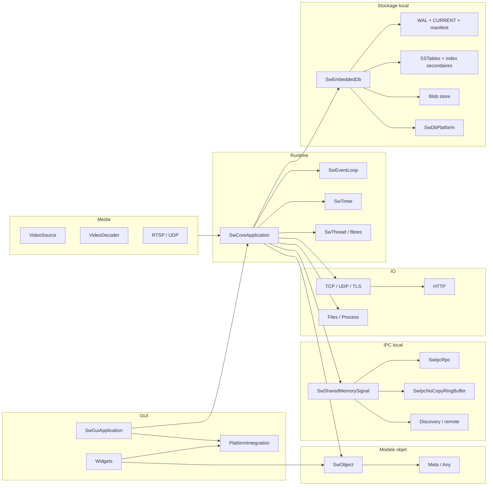

# Architecture (vue d'ensemble)

## Vue composants

Le depot s'appuie sur quatre briques principales :

1. Runtime cooperatif (`SwCoreApplication`, event loop, timers, fibres, threads).
2. Modele objet facon Qt (`SwObject`, signaux/slots, affinite thread).
3. IPC same-machine (SHM, RPC, ring buffers, discovery).
4. Stockage embarque local (`SwEmbeddedDb`) pour gros volumes sur disque local.

## Runtime

Intentions :

- executer des callbacks sans bloquer le thread principal,
- gerer timers, wakeups et fibres,
- permettre des attentes locales sans stopper tout le runtime.

References :

- `src/core/runtime/SwCoreApplication.h`
- `src/core/runtime/SwEventLoop.h`
- `src/core/runtime/SwTimer.h`
- `src/core/runtime/SwThread.h`

## Modele objet

Intentions :

- hierarchie parent/enfant,
- signaux/slots avec deconnexion,
- affinite thread et `moveToThread`.

References :

- `src/core/object/SwObject.h`
- `src/core/object/SwMetaType.h`

## IPC local

Intentions :

- pub/sub et RPC entre processus sur la meme machine,
- wakeups event-driven,
- transport efficace pour gros payloads.

References :

- `src/core/remote/SwSharedMemorySignal.h`
- `src/core/remote/SwIpcRpc.h`
- `src/core/remote/SwIpcNoCopyRingBuffer.h`

## Stockage local : `SwEmbeddedDb`

Intentions :

- base embarquee locale pure C++11,
- writer unique inter-process via lock OS,
- lecteurs multiples avec `CURRENT + MANIFEST + WAL`,
- primaire KV + index secondaires ordonnes,
- flush en SSTables immuables et blobs separes pour grosses valeurs.

References :

- `src/core/storage/SwEmbeddedDb.h`
- `src/core/platform/SwDbPlatform.h`

## GUI et Media

References :

- `src/core/gui/SwGuiApplication.h`
- `src/platform/SwPlatformIntegration.h`
- `src/media/SwVideoSource.h`
- `src/media/SwVideoDecoder.h`
