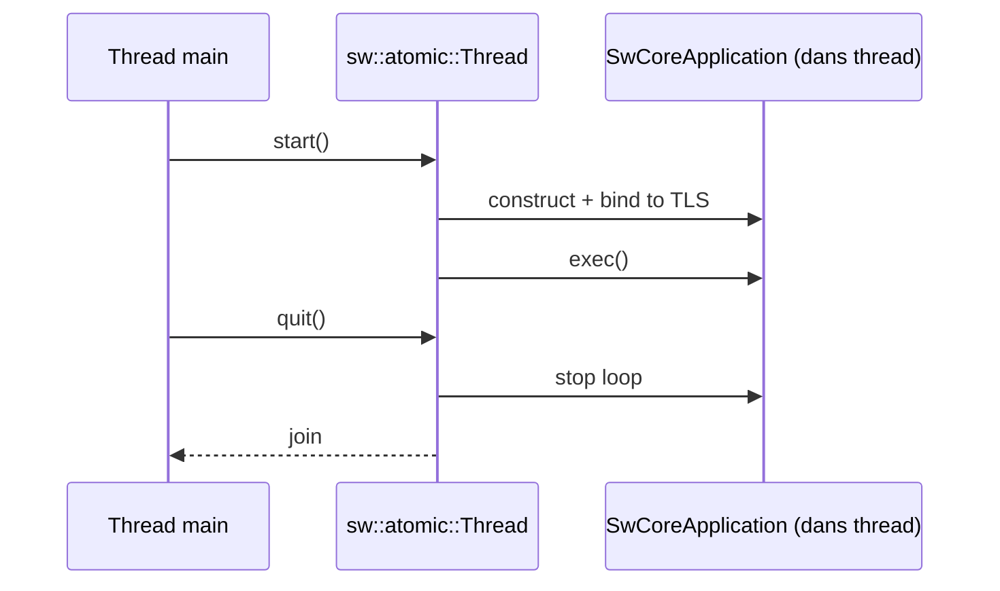

# Runtime: event loop, fibres, timers, threading

## 1) But (Pourquoi)

Le runtime fournit une exécution coopérative:

- exécuter des callbacks sans bloquer le thread,
- gérer timers + wakeups OS (handles/fds),
- permettre des “attentes” locales (nested event loop) sans figer tout le process,
- offrir un modèle de thread où chaque thread peut avoir son `SwCoreApplication`.

## 2) Périmètre

Inclut:
- event loop: `SwCoreApplication`, `SwEventLoop`,
- timers: `SwTimer`,
- threads: `SwThread` (haut niveau), `sw::atomic::Thread` (worker),
- fibres: impl Linux (ucontext) et Windows (`À CONFIRMER` chemins exacts).

Exclut:
- modèle objet/signaux (doc dédiée),
- IPC/remote (doc dédiée).

## 3) API & concepts

### `SwCoreApplication`

Rôle:
- instance runtime bindée au thread courant,
- boucle principale via `exec()`,
- gestion des events postés, timers, et attente de “work”.

Concepts visibles (liste non exhaustive `À CONFIRMER`):
- `postEvent(...)` / `processEvent()`,
- attente OS: `addWaitHandle(...)` / `addWaitFd(...)`,
- coop: `yieldFiber()` / `unYieldFiber()`.

Référence: `src/core/runtime/SwCoreApplication.h`.

### `SwEventLoop` (nested loop)

Rôle:
- lancer une boucle imbriquée, typiquement pour attendre une condition localement.

Référence: `src/core/runtime/SwEventLoop.h`.

### `SwTimer`

Rôle:
- timer attaché à un `SwObject`,
- helper `SwTimer::singleShot(...)`.

Référence: `src/core/runtime/SwTimer.h`.

### Threads

- `SwThread`: wrapper haut niveau (start/quit/wait) + integration event loop.
  - Référence: `src/core/runtime/SwThread.h`
- `sw::atomic::Thread`: worker thread + création d’un `SwCoreApplication` interne.
  - Référence: `src/atomic/thread.h`

## 4) Flux d’exécution (Comment)

### Boucle principale (simplifiée)

```mermaid
flowchart TD
  A[SwCoreApplication::exec] --> B[processEvent]
  B --> C{event dispo ?}
  C -->|oui| D[run callback (fiber)]
  C -->|non| E[process timers]
  D --> F[waitForWork]
  E --> F
  F --> B
```

`À CONFIRMER`: détails exacts du scheduler de fibres (ordre, starvation, fairness).

### Thread worker



## 5) Gestion d’erreurs

- Beaucoup de fonctions retournent `bool`/codes maison (`À CONFIRMER` conventions exactes).
- Sur Windows/Linux, l’attente OS peut échouer (handle/fd invalide) → logs + best-effort.

## 6) Perf & mémoire

- Fibres: coût de switch + stockage de stack (`À CONFIRMER` taille/stratégie).
- Timers: coût dépend du nombre de timers (scan/heap `À CONFIRMER` impl).
- Attente OS: réduction CPU vs polling.

## 7) Fichiers concernés (liste + rôle)

- `src/core/runtime/SwCoreApplication.h`
- `src/core/runtime/SwEventLoop.h`
- `src/core/runtime/SwTimer.h`
- `src/core/runtime/SwThread.h`
- `src/core/runtime/linux_fiber.h`
- `src/atomic/thread.h`

Exemples:
- `exemples/02-CoreApplication/ConsoleApplication.cpp` (boucle de base)
- `exemples/11-TestEventLoop/TestEventLoop.cpp` (nested loop)
- `exemples/12-TestThread/TestThread.cpp` (threads)
- `exemples/09-MultiRuntime/MultiRuntime.cpp` (multi runtime `À CONFIRMER`)

## 8) Exemples d’usage

### Timer + quit

```cpp
SwCoreApplication app(argc, argv);
SwTimer::singleShot(1000, [&](){ app.quit(); });
return app.exec();
```

## 9) TODO / À CONFIRMER

- `À CONFIRMER`: stratégie exacte de scheduling des fibres (priorités, fairness).
- `À CONFIRMER`: comportement “GUI wait” (Win32 message pump) via `SwGuiApplication`.
