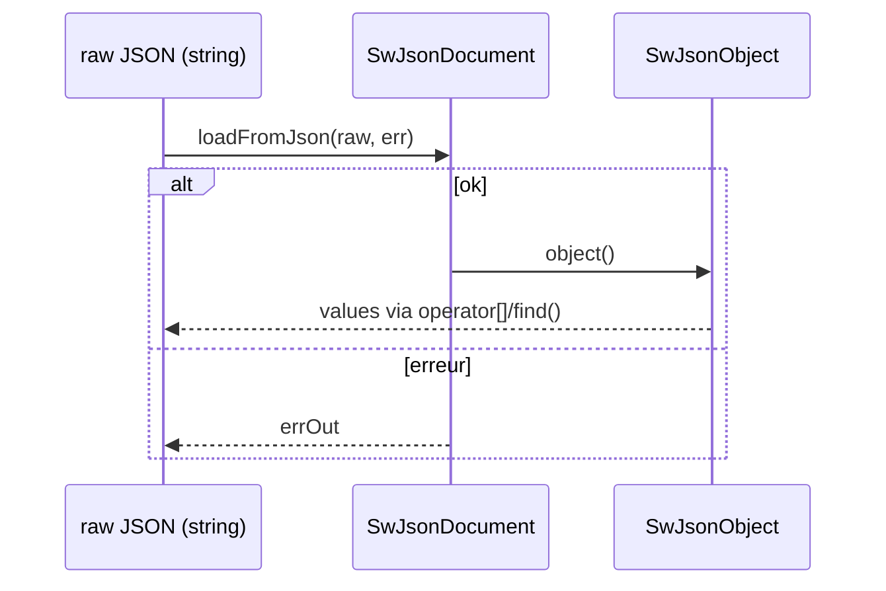

# Types & sérialisation: String/ByteArray/containers/JSON/regex/CLI

## 1) But (Pourquoi)

Proposer un socle de types utilitaires (inspirés de Qt) pour:

- manipuler des chaînes (`SwString`) et buffers (`SwByteArray`) sans dépendre de Qt,
- fournir des conteneurs simples (`SwList`, `SwMap`, `SwVector`, `SwPair`) uniformes dans le code,
- sérialiser/désérialiser via un DOM JSON (`SwJson*`),
- traiter des regex via une API légère (`SwRegularExpression`),
- parser des options CLI au-dessus de `SwCoreApplication` (`SwCommandLineParser`).

## 2) Périmètre

Inclut:
- `SwString` (conversions, split/replace… `À CONFIRMER` couverture exacte),
- `SwByteArray` (buffer binaire + helpers),
- conteneurs `SwList/SwMap/SwVector/SwPair`,
- JSON: `SwJsonDocument/Object/Array/Value`,
- regex: `SwRegularExpression`,
- CLI: `SwCommandLineParser`, `SwCommandLineOption`.

Exclut:
- IPC/RPC (qui réutilise JSON/ByteArray mais a ses propres protocoles), documenté ailleurs.

## 3) API & concepts

### `SwString`

`SwString` encapsule un `std::string` avec une API “Qt-like”.

Points notables (non exhaustif):
- conversions: `toInt/toFloat/toDouble`, `SwString::number(...)`,
- utilitaires: `trimmed`, `startsWith`, `contains`, `replace`, `split`, etc (`À CONFIRMER` liste complète),
- base64/AES via `SwCrypto`: `toBase64`, `fromBase64`, `encryptAES`, `decryptAES`.

Référence: `src/core/types/SwString.h`.

### `SwByteArray`

Buffer binaire (souvent utilisé comme buffer réseau/HTTP et pour JSON):

- API type string/buffer: `append`, `left`, `mid`, `indexOf`, etc (`À CONFIRMER` détails exacts).

Référence: `src/core/types/SwByteArray.h`.

### JSON (DOM)

`SwJsonDocument` / `SwJsonObject` / `SwJsonArray` + `SwJsonValue` fournissent:

- parsing: `SwJsonDocument::loadFromJson(raw, errOut)` (utilisé par `SwRemoteObject` et `SW_REMOTE_OBJECT_NODE`)
- génération: `toJson()` / `toJsonString()` (compact/pretty selon format)
- accès DOM: `SwJsonObject::operator[]`, `contains`, `keys`, `insert/remove`, itérateurs
- navigation “path”: `SwJsonDocument::find(path, create)` (utilisé côté config `À CONFIRMER` selon version)

Références:
- `src/core/types/SwJsonDocument.h`
- `src/core/types/SwJsonObject.h`
- `src/core/types/SwJsonArray.h`
- `src/core/types/SwJsonValue.h`

### Regex

`SwRegularExpression` encapsule `std::regex`:

- `match(text)` -> `SwRegularExpressionMatch` (captured, start/end)
- `globalMatch(text)` -> `SwList<SwString>`
- `SwString::remove(SwRegularExpression)` est défini inline.

Référence: `src/core/types/SwRegularExpression.h`.

### CLI

`SwCommandLineParser` parse au-dessus de `SwCoreApplication`:

- `addOption`, `addHelpOption`, `process(app)` (lit `app.hasArgument()/getArgument()`)
- `isSet(key)`, `value(key, default)`

Références:
- `src/core/runtime/SwCommandLineParser.h`
- `src/core/runtime/SwCommandLineOption.h`
- `src/core/runtime/SwCoreApplication.h` (`parseArguments`, `getArgument`, `hasArgument`)

## 4) Flux d’exécution (Comment)

### Parsing JSON typique



### CLI typique

- `SwCoreApplication(argc, argv)` parse les arguments (stockage interne).
- `SwCommandLineParser::process(app)` relit ces args et produit options + positionnels.

## 5) Gestion d’erreurs

- Conversion num dans `SwString`:
  - `À CONFIRMER`: stratégie exacte (valeur par défaut + éventuel log stderr).
- Regex:
  - `SwRegularExpression` marque un état invalide en cas de `std::regex_error`.
- JSON:
  - parsing renvoie `false` + `errOut` (voir `SwJsonDocument::loadFromJson`).

## 6) Perf & mémoire

- `SwString` encapsule un `std::string`: copies possibles (attention aux retours par valeur).
- JSON DOM: allocations selon taille du document; `find(create=true)` peut créer des nœuds.
- `std::regex` peut être coûteux; `SwRegularExpression` compile le pattern au constructeur.

## 7) Fichiers concernés (liste + rôle)

Types:
- `src/core/types/Sw.h` (types simples/enums)
- `src/core/types/SwString.h`
- `src/core/types/SwByteArray.h`
- `src/core/types/SwList.h`, `src/core/types/SwMap.h`, `src/core/types/SwVector.h`, `src/core/types/SwPair.h`
- `src/core/types/SwHash.h`, `src/core/types/SwFlags.h`, `src/core/types/SwDateTime.h`
- `src/core/types/SwCrypto.h`
- `src/core/types/SwDebug.h`
- `src/core/types/SwRegularExpression.h`

JSON:
- `src/core/types/SwJsonDocument.h`
- `src/core/types/SwJsonObject.h`
- `src/core/types/SwJsonArray.h`
- `src/core/types/SwJsonValue.h`

CLI:
- `src/core/runtime/SwCommandLineOption.h`
- `src/core/runtime/SwCommandLineParser.h`

## 8) Exemples d’usage

### JSON: charger + lire

```cpp
#include "SwJsonDocument.h"

SwJsonDocument doc;
SwString err;
if (doc.loadFromJson("{\"a\": 1}", err) && doc.isObject()) {
  SwJsonObject o = doc.object();
  int a = o["a"].toInt();
  (void)a;
}
```

### CLI: parser au-dessus de `SwCoreApplication`

```cpp
SwCoreApplication app(argc, argv);
SwCommandLineParser p;
p.addHelpOption();
p.addOption(SwCommandLineOption({"o","output"}, "Output file", "file", true));
if (!p.process(app)) { /* p.error() */ }
SwString out = p.value("output", "default.txt");
```

## 9) TODO / À CONFIRMER

- `À CONFIRMER`: couverture complète des méthodes utilitaires de `SwString` / `SwByteArray`.
- `À CONFIRMER`: limites du parser JSON (unicode/escapes/chunked, perf).
- `À CONFIRMER`: usages réels de `SwHash` dans le repo (vs `std::hash`).
