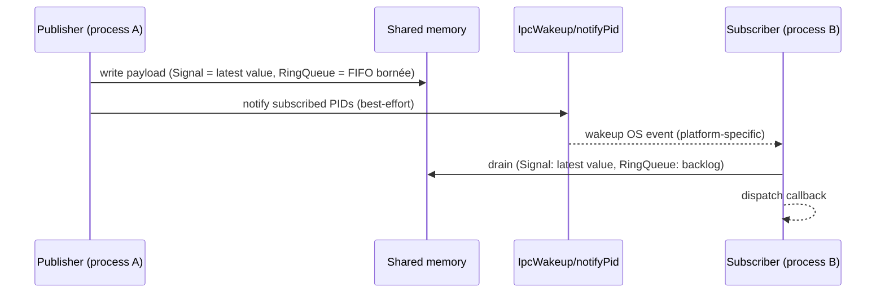

# IPC SHM pub/sub: `SwSharedMemorySignal` (Signal<T...>, registries, wakeups)

Référence principale: `src/core/remote/SwSharedMemorySignal.h`.

## 1) But (Pourquoi)

Fournir un mécanisme pub/sub inter-process “same machine”:

- transport à très faible overhead (pas de TCP),
- “latest value wins” pour des signaux d’état (le subscriber lit le dernier message),
- réveil event-driven (éviter le polling) via wakeups OS,
- discovery/introspection best-effort via des registries en mémoire partagée.

## 2) Périmètre

Inclut:
- nommage des objets SHM (domain/sys + object + signal),
- registries (apps, signaux, subscribers),
- transport pub/sub (queues + codecs),
- dispatch côté subscriber via `LoopPoller` + `IpcWakeup`.

Exclut:
- RPC (documenté dans `docs/features/40_ipc_rpc_remote_components.md`),
- orchestration (launcher, superviseur).

## 3) API & concepts

### Registry / naming

- Un `sw::ipc::Registry` est construit à partir d’un domaine (souvent `sys/ns/name`), puis sert à:
  - publier des signaux (création/nommage),
  - s’abonner à des signaux,
  - publier des entrées dans les registries (best-effort).

Référence: `src/core/remote/SwSharedMemorySignal.h` (`class Registry`, `detail::make_shm_name`, `signalsRegistryNameForDomain_`, `subscribersRegistryNameForDomain_`).

Notes (naming SHM):
- Les segments SHM des signaux ne portent pas un nom lisible: `detail::make_shm_name(domain, object, signal)` calcule un nom court hashé (`sw_sig_<hex>` sur Windows, `/sw_sig_<hex>` sur POSIX).
- Les registries servent à l’introspection (et aux wakeups): `shmRegistrySnapshot(domain)` / `shmSubscribersSnapshot(domain)`.

### Signal proxy côté publisher

Macro d’usage courant:

- `SW_REGISTER_SHM_SIGNAL(name, ...)` déclare un `sw::ipc::SignalProxy<Args...>` lié à `ipcRegistry_`.

Référence: `src/core/remote/SwSharedMemorySignal.h` (macro `SW_REGISTER_SHM_SIGNAL`, type `SignalProxy`).

### LoopPoller / IpcWakeup

Principe:

- côté publisher: après écriture d’un nouveau message, les PIDs subscribers sont notifiés best-effort.
- côté subscriber: un poller se réveille, puis draine les signaux prêts.

Référence: `src/core/remote/SwSharedMemorySignal.h` (`class LoopPoller`, `class IpcWakeup`, `LoopPollerDispatchRegistry`).

## 4) Flux d’exécution (Comment)

### Publication d’un signal (résumé)



### Subscription

API (exacte) dans `src/core/remote/SwSharedMemorySignal.h`:

- `sw::ipc::Signal<Args...>` (signal d’état “latest value wins”):
  - construction: `sw::ipc::Registry reg(domain, object); sw::ipc::Signal<A...> sig(reg, "signalName");`
  - subscribe: `auto sub = sig.connect(cb, /*fireInitial=*/true, /*timeoutMs=*/0);`
  - unsubscribe: `sub.stop()` (sinon RAII: le destructeur stop automatiquement)
  - `fireInitial=true` force une 1ère exécution du callback avec la dernière valeur publiée (si une valeur existe), même si aucun publish n’arrive après le `connect()`.
- `sw::ipc::RingQueue<Capacity, Args...>` (file FIFO bornée, multi-producer / single-consumer):
  - même API de subscription: `queue.connect(cb, fireInitial, timeoutMs)` (le callback est appelé pour chaque message drainé).

Helpers côté `SwRemoteObject` (dans `src/core/remote/SwRemoteObject.h`):
- `ipcConnect("sys/ns/name#signal", lambda [, fireInitial])` → retourne un `size_t token`, stocké en interne → `ipcDisconnect(token)`.
- `ipcConnect("targetObject", "signal", context, lambda [, fireInitial])` → retourne un `SwObject*` (connection) owned par `context` (auto-stop à la destruction).

Références:
- `src/core/remote/SwSharedMemorySignal.h`
- `src/core/remote/SwRemoteObject.h` (helpers `ipcConnect` / subscription côté RemoteObject)

## 5) Gestion d’erreurs

- SHM:
  - `openOrCreate(...)` peut lever `std::runtime_error` (CreateFileMapping/MapViewOfFile, `shm_open`/`mmap`, mismatch `magic/version`, mismatch `typeId`).
  - Les registries (`shmRegistrySnapshot`, `shmSubscribersSnapshot`, register/unregister) sont best-effort: exceptions catchées → snapshot vide / no-op.
- Wakeups:
  - notifications OS best-effort (PID mort, handle inexistant, sendto échoue) → si un wakeup est “perdu”, le prochain wakeup suffit généralement à rattraper (lecture basée sur `seq` / `readSeq`).
  - pas de polling périodique implémenté: tout est event-driven (wakeup OS + dispatch du `LoopPoller`).
- Registries:
  - entrées stale possibles après crash; l’écosystème doit tolérer l’incohérence.

## 6) Perf & mémoire

- “latest value wins” limite la croissance mémoire (pas d’historique illimité).
- Copies:
  - `SwByteArray` et JSON peuvent induire des copies si utilisés comme payload.
- Wakeups:
  - réduction du CPU (évite polling serré) au prix d’une infrastructure OS (events/sockets).

## 7) Fichiers concernés (liste + rôle)

Core:
- `src/core/remote/SwSharedMemorySignal.h`: mécanisme IPC (SHM, registries, codecs, queues, wakeups, LoopPoller).

Dépendances types:
- `src/core/types/SwString.h`: noms domain/object/signal, conversions.
- `src/core/types/SwByteArray.h`: payload binaire (ex: JSON transporté par d’autres couches).

Exemples:
- `exemples/23-ConfigurableObjectDemo/DemoSubscriber.h` (déclare plusieurs signaux via `SW_REGISTER_SHM_SIGNAL`)
- `exemples/26-IpcThreadStress/IpcThreadStress.cpp` (stress pub/sub + threads)
- `exemples/29-IpcPingPongNodes/SwPingNode.cpp`, `exemples/29-IpcPingPongNodes/SwPongNode.cpp` (ping/pong via SHM)

## 8) Exemples d’usage

### Publisher (dans un `SwRemoteObject`)

```cpp
class PingNode : public SwRemoteObject {
 public:
  using SwRemoteObject::SwRemoteObject;
 private:
  SW_REGISTER_SHM_SIGNAL(ping, int, SwString);
  void tick_() { (void)emit ping(1, SwString("ping")); }
};
```

### Subscriber

Deux façons courantes:

1) Bas niveau (`sw::ipc::Signal<Args...>`):

```cpp
#include "SwSharedMemorySignal.h"

sw::ipc::Registry reg("demo", "demo/pong");      // domain=sys, object=namespace/objectName
sw::ipc::Signal<int, SwString> pong(reg, "pong");

auto sub = pong.connect([](int seq, SwString msg) {
  swDebug() << "[Ping] got pong seq=" << seq << " msg=" << msg;
}, /*fireInitial=*/true);
// sub.stop(); // optionnel (RAII)
```

2) Depuis un `SwRemoteObject` (macro `ipcConnect` qui déduit les types depuis la lambda):

```cpp
// "pong#pong" = target relatif (même sys + même namespace que l’objet courant).
size_t token = ipcConnect("pong#pong",
                          [this](int seq, SwString msg) {
                            swDebug() << "[Ping] got pong seq=" << seq << " msg=" << msg;
                          },
                          /*fireInitial=*/true);

// ... plus tard
ipcDisconnect(token);
```

## 9) Sémantique, limites, wakeups (confirmé)

### 9.1 `sw::ipc::Signal<Args...>` (“latest value wins”)

- Stockage: un seul payload (max `4096` bytes) dans `ShmLayout` + compteur `seq`.
- `publish(...)`: overwrite (`data`/`size`) puis incrémente `seq`.
- `connect(...)`: si plusieurs publish arrivent entre 2 dispatch, le callback ne voit que la **dernière** valeur (c’est un signal d’état, pas une file).
- Atomicité multi-args: les arguments sont encodés dans un buffer unique → le subscriber reçoit toujours un tuple cohérent issu d’un seul publish.

### 9.2 `sw::ipc::RingQueue<Capacity, Args...>` (backpressure / drop policy)

- FIFO bornée (multi-producer / single-consumer): `seq` = write, `readSeq` = read.
- Capacité: `Capacity` (template) et payload max `4096` bytes par slot.
- Surproduction: si backlog `seq - readSeq >= Capacity`, alors `push(...)` retourne `false` (le message n’est pas écrit → drop côté publisher).

### 9.3 Wakeups OS (event-driven)

- Dans chaque process subscriber, `detail::LoopPoller` s’attache à un wakeup OS et déclenche `dispatchAll()`:
  - Windows: event nommé `Local\\sw_ipc_notify_<pid>` (`CreateEventA`/`SetEvent`).
  - POSIX: socket datagram `AF_UNIX` (namespace abstrait) nommé `sw_ipc_notify_<pid>`; le subscriber draine les datagrams puis dispatch.
- Pour `Signal::publish` (et `RingQueue::push` sur POSIX), le publisher récupère les PIDs via `SubscribersRegistryTable::listSubscriberPids(domain, object, signal)` puis appelle `LoopPoller::notifyProcess(pid)` (best-effort).
- Spécifique Windows / `RingQueue`: `RingQueue::push` déclenche aussi l’event nommé `<shmName>_evt` (où `shmName` est le nom hashé du segment), utilisé par `RingQueue::connect` quand `SwCoreApplication` est disponible.
- Wakeups coalescés: plusieurs notifs peuvent provoquer un seul dispatch; la lecture basée sur `seq` / `readSeq` permet de rattraper (dans la limite de `Capacity` pour `RingQueue`).
