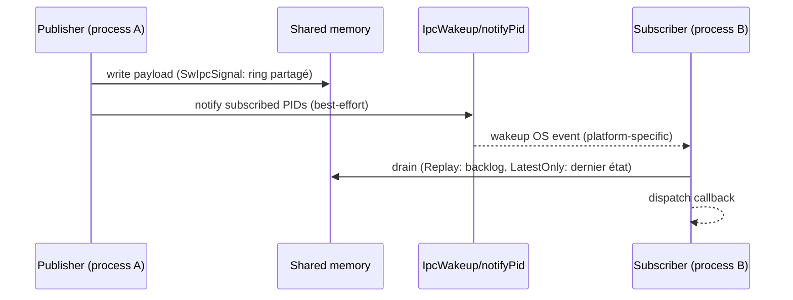

# IPC SHM pub/sub: `SwSharedMemorySignal` (SwIpcSignal<T...>, registries, wakeups)

Référence principale: `src/core/remote/SwSharedMemorySignal.h`.

## 1) But (Pourquoi)

Fournir un mécanisme pub/sub inter-process “same machine”:

- transport à très faible overhead (pas de TCP),
- “latest value wins” pour des signaux d’état (le subscriber lit le dernier message),
- réveil event-driven (éviter le polling) via wakeups OS,
- discovery/introspection best-effort via des registries en mémoire partagée.

## 2) Périmètre

Inclut:
- nommage des objets SHM (domain/sys + object + signal),
- registries (apps, signaux, subscribers),
- transport pub/sub (queues + codecs),
- dispatch côté subscriber via `LoopPoller` + `IpcWakeup`.

Exclut:
- RPC (documenté dans `docs/features/40_ipc_rpc_remote_components.md`),
- orchestration (launcher, superviseur).

## 3) API & concepts

### Registry / naming

- Un `sw::ipc::Registry` est construit à partir d’un domaine (souvent `sys/ns/name`), puis sert à:
  - publier des signaux (création/nommage),
  - s’abonner à des signaux,
  - publier des entrées dans les registries (best-effort).

Référence: `src/core/remote/SwSharedMemorySignal.h` (`class Registry`, `detail::make_shm_name`, `signalsRegistryNameForDomain_`, `subscribersRegistryNameForDomain_`).

Notes (naming SHM):
- Les segments SHM des signaux ne portent pas un nom lisible: `detail::make_shm_name(domain, object, signal)` calcule un nom court hashé (`sw_sig_<hex>` sur Windows, `/sw_sig_<hex>` sur POSIX).
- Les registries servent à l’introspection (et aux wakeups): `shmRegistrySnapshot(domain)` / `shmSubscribersSnapshot(domain)`.

### Présence et reprise après un retard du runtime

Le heartbeat est rafraîchi toutes les secondes par le runtime propriétaire.
Après 15 secondes sans rafraîchissement, les snapshots masquent les entrées
expirées : un processus encore vivant peut avoir une boucle événementielle bloquée.
Ses déclarations restent conservées dans la registry pour que le prochain
heartbeat puisse rétablir sa présence. Un lecteur ouvrant le même signal ne
devient pas propriétaire simplement parce que ce heartbeat est ancien.

Les abonnements d'un processus vivant conservent aussi leur compteur de
références et leur destination de réveil pendant cette pause. Ils sont retirés
à la désinscription ou à la disparition du processus. Les entrées des processus
terminés sont récupérées, notamment avant d'inscrire un nouveau signal dans une
registry pleine. La sérialisation JSON des snapshots se fait hors du verrou
partagé utilisé par les publications IPC.

Tous les participants, y compris `SwLaunch` et les outils d'inspection, doivent
être recompilés ensemble. Les registries utilisent la génération `r3` :
`sw_ipc_apps_r3`, `sw_ipc_registry_r3_<suffixe>` et
`sw_ipc_subs_r3_<suffixe>`. Les anciens segments ne sont pas rouverts ni modifiés.
Cette séparation évite de reprendre un mutex non récupérable laissé verrouillé
par un ancien exécutable. Les noms et formats des files de données restent identiques.

Sous Linux, les trois registries utilisent des mutex partagés robustes. Si un
processus meurt en tenant un verrou, le prochain acquéreur borne les compteurs,
retire les entrées incomplètes ou appartenant aux processus terminés, puis rend
le mutex cohérent avant de poursuivre. Un verrou détenu par un processus vivant
reste protégé. La création des segments est sérialisée par un verrou de fichier ;
une initialisation interrompue peut être reprise sans réinitialiser un segment
déjà publié. Cette récupération concerne les métadonnées de découverte et de
réveil, pas une restauration des données applicatives.

### Signal dimensionné côté publisher

Macro d’usage courant:

- `SW_IPC_SIGNAL_SIZED(name, 4096, ...)` déclare un `sw::ipc::SwIpcSignal<Args...>` lié à `ipcRegistry_`.

Référence: `src/core/remote/SwSharedMemorySignal.h` (macros `SW_IPC_SIGNAL_SIZED` / `SW_IPC_LATCH_SIZED`, type `SwIpcSignal`).

### LoopPoller / IpcWakeup

Principe:

- côté publisher: après écriture d’un nouveau message, les PIDs subscribers sont notifiés best-effort.
- côté subscriber: un poller se réveille, puis draine les signaux prêts.

Référence: `src/core/remote/SwSharedMemorySignal.h` (`class LoopPoller`, `class IpcWakeup`, `LoopPollerDispatchRegistry`).

## 4) Flux d’exécution (Comment)

### Publication d’un signal (résumé)


```mermaid
sequenceDiagram
  participant Pub as Publisher (process A)
  participant SHM as Shared memory
  participant W as IpcWakeup/notifyPid
  participant Sub as Subscriber (process B)

  Pub->>SHM: write payload (SwIpcSignal: ring partagé)
  Pub->>W: notify subscribed PIDs (best-effort)
  W-->>Sub: wakeup OS event (platform-specific)
  Sub->>SHM: drain (Replay: backlog, LatestOnly: dernier état)
  Sub-->>Sub: dispatch callback
```

### Subscription

API (exacte) dans `src/core/remote/SwSharedMemorySignal.h`:

- `sw::ipc::SwIpcSignal<Args...>` (ring de signaux, modes `Replay` / `LatestOnly`):
  - construction: `sw::ipc::Registry reg(domain, object); sw::ipc::SwIpcSignal<A...> sig(reg, "signalName", 16, 4096);`
  - subscribe: `auto sub = sig.connect(cb, /*fireInitial=*/true, /*timeoutMs=*/0);`
  - unsubscribe: `sub.stop()` (sinon RAII: le destructeur stop automatiquement)
  - `fireInitial=true` livre la dernière valeur en `LatestOnly`, ou le backlog encore disponible en `Replay`, même sans nouvelle publication après le `connect()`.
- `sw::ipc::RingQueue<Capacity, Args...>` (file FIFO bornée, multi-producer / single-consumer):
  - même API de subscription: `queue.connect(cb, fireInitial, timeoutMs)` (le callback est appelé pour chaque message drainé).

Helpers côté `SwRemoteObject` (dans `src/core/remote/SwRemoteObject.h`):
- `ipcConnect("sys/ns/name#signal", lambda [, fireInitial])` → retourne un `size_t token`, stocké en interne → `ipcDisconnect(token)`.
- `ipcConnect("targetObject", "signal", context, lambda [, fireInitial])` → retourne un `SwObject*` (connection) owned par `context` (auto-stop à la destruction).

Références:
- `src/core/remote/SwSharedMemorySignal.h`
- `src/core/remote/SwRemoteObject.h` (helpers `ipcConnect` / subscription côté RemoteObject)

## 5) Gestion d’erreurs

- SHM:
  - `openOrCreate(...)` peut lever `std::runtime_error` (CreateFileMapping/MapViewOfFile, `shm_open`/`mmap`, mismatch `magic/version`, mismatch `typeId`).
  - Les registries (`shmRegistrySnapshot`, `shmSubscribersSnapshot`, register/unregister) sont best-effort: exceptions catchées → snapshot vide / no-op.
- Wakeups:
  - notifications OS best-effort (PID mort, handle inexistant, sendto échoue) → si un wakeup est “perdu”, le prochain wakeup suffit généralement à rattraper (lecture basée sur `seq` / `readSeq`).
  - pas de polling périodique implémenté: tout est event-driven (wakeup OS + dispatch du `LoopPoller`).
- Registries:
  - entrées stale possibles après crash; l’écosystème doit tolérer l’incohérence.

## 6) Perf & mémoire

- “latest value wins” limite la croissance mémoire (pas d’historique illimité).
- Copies:
  - `SwByteArray` et JSON peuvent induire des copies si utilisés comme payload.
- Wakeups:
  - réduction du CPU (évite polling serré) au prix d’une infrastructure OS (events/sockets).

## 7) Fichiers concernés (liste + rôle)

Core:
- `src/core/remote/SwSharedMemorySignal.h`: mécanisme IPC (SHM, registries, codecs, queues, wakeups, LoopPoller).

Dépendances types:
- `src/core/types/SwString.h`: noms domain/object/signal, conversions.
- `src/core/types/SwByteArray.h`: payload binaire (ex: JSON transporté par d’autres couches).

Exemples:
- `exemples/23-ConfigurableObjectDemo/DemoSubscriber.h` (déclare plusieurs signaux via `SW_IPC_SIGNAL_SIZED`)
- `exemples/26-IpcThreadStress/IpcThreadStress.cpp` (stress pub/sub + threads)
- `exemples/29-IpcPingPongNodes/SwPingNode.cpp`, `exemples/29-IpcPingPongNodes/SwPongNode.cpp` (ping/pong via SHM)

## 8) Exemples d’usage

### Publisher (dans un `SwRemoteObject`)

```cpp
class PingNode : public SwRemoteObject {
 public:
  using SwRemoteObject::SwRemoteObject;
 private:
  SW_IPC_SIGNAL_SIZED(ping, 4096, int, SwString);
  void tick_() { (void)emit ping(1, SwString("ping")); }
};
```

### Subscriber

Deux façons courantes:

1) Bas niveau (`sw::ipc::SwIpcSignal<Args...>`):

```cpp
#include "SwSharedMemorySignal.h"

sw::ipc::Registry reg("demo", "demo/pong");      // domain=sys, object=namespace/objectName
sw::ipc::SwIpcSignal<int, SwString> pong(reg, "pong", 16, 4096);

auto sub = pong.connect([](int seq, SwString msg) {
  swDebug() << "[Ping] got pong seq=" << seq << " msg=" << msg;
}, /*fireInitial=*/true);
// sub.stop(); // optionnel (RAII)
```

2) Depuis un `SwRemoteObject` (macro `ipcConnect` qui déduit les types depuis la lambda):

```cpp
// "pong#pong" = target relatif (même sys + même namespace que l’objet courant).
size_t token = ipcConnect("pong#pong",
                          [this](int seq, SwString msg) {
                            swDebug() << "[Ping] got pong seq=" << seq << " msg=" << msg;
                          },
                          /*fireInitial=*/true);

// ... plus tard
ipcDisconnect(token);
```

## 9) Sémantique, limites, wakeups (confirmé)

### 9.1 `sw::ipc::SwIpcSignal<Args...>`

- Stockage : ring dynamique dimensionné par capacité et taille sérialisée maximale.
- `Replay` : un curseur propre à chaque abonnement conserve les publications en attente ;
  `publish(...)` retourne `false` si un abonné Replay empêche de libérer un slot.
- `LatestOnly` : les états remplacent la valeur précédente sans être bloqués par un lecteur d'état lent.
- `readLatest(...)` : lecture cohérente du dernier tuple, indépendante des curseurs.
- Les chaînes et collections exigent une taille explicite (`_SIZED`).
- Les segments des signaux utilisent un nom versionné ; les exécutables doivent être migrés ensemble.
- Atomicité multi-args : les arguments sont encodés dans un buffer unique.

### 9.2 `sw::ipc::RingQueue<Capacity, Args...>` (backpressure / drop policy)

- FIFO bornée (multi-producer / single-consumer): `seq` = write, `readSeq` = read.
- Capacité: `Capacity` (template) et payload max `4096` bytes par slot.
- Surproduction: si backlog `seq - readSeq >= Capacity`, alors `push(...)` retourne `false` (le message n’est pas écrit → drop côté publisher).

### 9.3 Wakeups OS (event-driven)

- Dans chaque process subscriber, `detail::LoopPoller` s’attache à un wakeup OS et déclenche `dispatchAll()`:
  - Windows: event nommé `Local\\sw_ipc_notify_<pid>` (`CreateEventA`/`SetEvent`).
  - POSIX: socket datagram `AF_UNIX` (namespace abstrait) nommé `sw_ipc_notify_<pid>`; le subscriber draine les datagrams puis dispatch.
- Pour `SwIpcSignal::publish` (et `RingQueue::push` sur POSIX), le publisher récupère les PIDs via `SubscribersRegistryTable::listSubscriberPids(domain, object, signal)` puis appelle `LoopPoller::notifyProcess(pid)` (best-effort).
- Spécifique Windows / `RingQueue`: `RingQueue::push` déclenche aussi l’event nommé `<shmName>_evt` (où `shmName` est le nom hashé du segment), utilisé par `RingQueue::connect` quand `SwCoreApplication` est disponible.
- Wakeups coalescés: plusieurs notifs peuvent provoquer un seul dispatch; la lecture basée sur `seq` / `readSeq` permet de rattraper (dans la limite de `Capacity` pour `RingQueue`).
