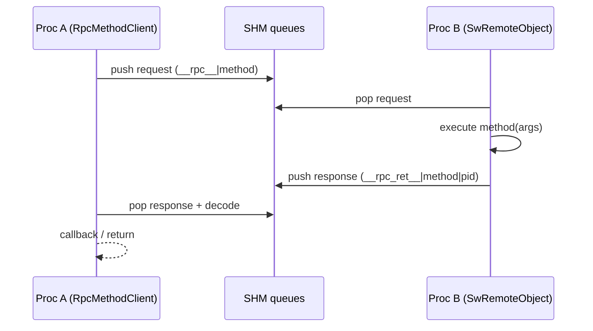

# IPC RPC + remotes + plugins/container

## 1) But (Pourquoi)

Compléter le pub/sub SHM par une couche RPC + discovery pour:

- appeler des “méthodes” sur un autre processus (request/response),
- découvrir des targets disponibles (best-effort),
- instancier des composants via plugins (registry + DLL/SO).

## 2) Périmètre

Inclut:
- naming des queues RPC (request + response),
- client RPC typé (templates Ret/Args),
- côté serveur RPC via `SwRemoteObject` (helpers `ipcExposeRpc*`),
- discovery/proxy objects (`SwProxyObject*`),
- plugins/components: registry + macro d’enregistrement + chargement via `SwLibrary`.

Exclut:
- pub/sub SHM bas niveau (documenté dans `docs/features/30_ipc_shared_memory_pubsub.md`).

## 3) API & concepts

### Queues RPC (naming)

- request queue: `__rpc__|<method>`
- response queue: `__rpc_ret__|<method>|<pid_client>`

Référence: `src/core/remote/SwIpcRpc.h` (`rpcRequestQueueName`, `rpcResponseQueueName`).

### Client RPC typé: `RpcMethodClient`

`RpcMethodClient<Ret, Args...>`:

- encapsule un `Registry` + deux queues SHM (req/resp),
- sérialise les args (JSON ou binaire `À CONFIRMER` exact),
- attend/collecte la réponse (avec timeout `À CONFIRMER`).

Référence: `src/core/remote/SwIpcRpc.h` (`template<class Ret, class... Args> class RpcMethodClient`).

### Serveur RPC: helpers `SwRemoteObject`

`SwRemoteObject` expose:

- `ipcExposeRpc(name, this, &Class::method, fireInitial)`
- `ipcExposeRpcStr(...)`

Ces helpers s’appuient sur SHM: subscribe à la queue request et publient sur la queue response.

Référence: `src/core/remote/SwRemoteObject.h` (section `ipcExposeRpc*`, impl `ipcExposeRpcT`).

### Remotes / discovery

`SwProxyObject` et `SwProxyObjectBrowser` encapsulent la découverte d’objets/méthodes:

- snapshot des registries,
- signaux appeared/disappeared,
- introspection “functions/argType”.

Références:
- `src/core/remote/SwProxyObject.h` (`discoverRpcTargets`, `functions`, `argType`)
- `src/core/remote/SwProxyObjectBrowser.h`

### Plugins/components

Principe:

- une DLL/SO expose un symbole connu (ex: `swRegisterRemoteObjectComponentsV1`) et enregistre des factory functions dans un registry.
- le container charge des plugins et instancie des composants à partir d’un JSON de composition.

Références:
- `src/core/remote/SwRemoteObjectComponentRegistry.h` (typeName → create/destroy)
- `src/core/remote/SwRemoteObjectComponent.h` (macro `SW_REGISTER_COMPONENT_NODE`, symbole exporté)
- `src/core/runtime/SwLibrary.h` (LoadLibrary/dlopen)
- Exemple container: `SwNode/SwComponentContainer/SwComponentContainer.cpp`

## 4) Flux d’exécution (Comment)

### RPC call (résumé)



### Container/plugins (résumé)

- Le container lit une “composition” (plugins + composants).
- Charge chaque plugin via `SwLibrary`.
- Appelle la fonction d’enregistrement du plugin pour remplir `SwRemoteObjectComponentRegistry`.
- Instancie les composants demandés (`type`, `ns`, `name`, `params`) et applique la config.

Référence: `SwNode/SwComponentContainer/SwComponentContainer.cpp` (champs JSON: voir section `composition/*` et parsing de `composition/components`).

## 5) Gestion d’erreurs

- RPC:
  - absence de serveur / méthode: request non traitée → timeout côté client (`À CONFIRMER` stratégie).
  - corruption/format inattendu: reject/log.
- Plugins:
  - load DLL échoue (path, symbol missing) → erreur de chargement.
  - API version mismatch (`V1`) → à gérer explicitement (`À CONFIRMER`).

## 6) Perf & mémoire

- RPC SHM:
  - latence faible vs TCP, mais copies possibles selon sérialisation.
- Plugins:
  - coût du chargement dynamique; préférer warm-up si nécessaire.

## 7) Fichiers concernés (liste + rôle)

RPC/remotes:
- `src/core/remote/SwIpcRpc.h`
- `src/core/remote/SwProxyObject.h`
- `src/core/remote/SwProxyObjectBrowser.h`
- `src/core/remote/SwRemoteObject.h` (helpers serveur)

Plugins/components:
- `src/core/remote/SwRemoteObjectComponentRegistry.h`
- `src/core/remote/SwRemoteObjectComponent.h`
- `src/core/runtime/SwLibrary.h`

Exemples:
- `exemples/23-ConfigurableObjectDemo/*.cpp` (RPC + config `À CONFIRMER` détails)
- `SwNode/SwComponentContainer/SwComponentContainer.cpp` (container)
- `exemples/24-ComponentPlugin/PingPongPlugin.cpp` (plugin example)
- `SwNode/SwAPI/SwBridge/*.cpp` (console web et introspection `À CONFIRMER`)
- `SwNode/SwAPI/SwApi/*.cpp` (CLI `swapi`: introspection registry + appels RPC)

## 8) Exemples d’usage

### Client RPC (illustratif)

```cpp
// À CONFIRMER: API exacte de construction/usage selon la classe RpcMethodClient.
RpcMethodClient<int, SwString> ping("sys/ns/name", "ping");
int rc = ping.call(SwString("hello"));
```

### CLI `swapi` (pratique)

Voir `docs/nodes/SwApi.md`.

```bash
swapi rpc list demo/demo/container
swapi container status demo/demo/container --pretty
```

## 9) TODO / À CONFIRMER

- `À CONFIRMER`: impl exacte côté serveur (matching callId, multi-clients, backpressure) dans `src/core/remote/SwRemoteObject.h`.
- `À CONFIRMER`: format de sérialisation RPC (JSON/binaire, endianness, compat).
- `À CONFIRMER`: limites de discovery (stale entries, timeouts) et impact sur superviseur/launcher.
