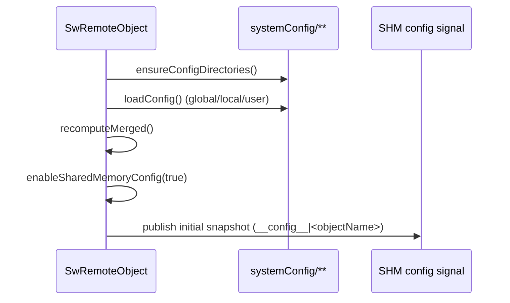
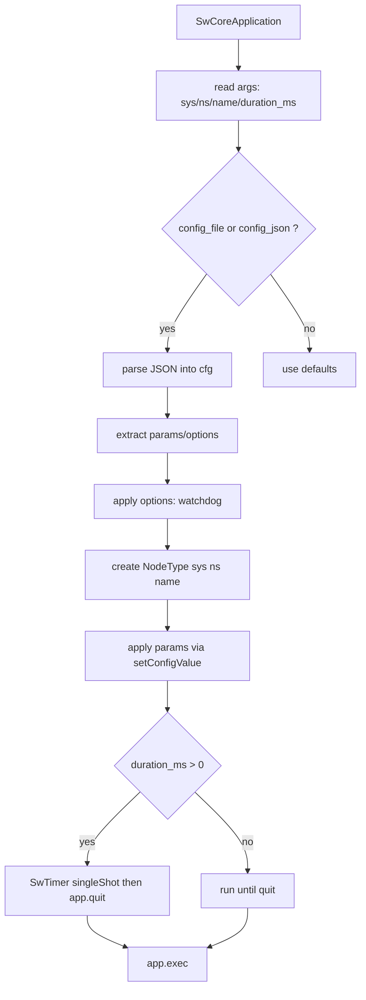

# Config & nodes: `SwRemoteObject`, `systemConfig/`, `SW_REMOTE_OBJECT_NODE`

## 1) But (Pourquoi)

Objectif: offrir une configuration **persistée** et **diffusable** pour des composants exposés en IPC:

- configuration JSON en surcouches (global/local/user),
- écriture des overrides au bon endroit (typiquement `systemConfig/user/`),
- diffusion optionnelle via IPC (mémoire partagée) pour outils externes (console web, superviseur, etc),
- standardiser les processus “nodes” pilotés par JSON/args (sys/ns/name, params, options).

## 2) Périmètre

Inclut:
- `SwRemoteObject`: base `SwObject` + config multi-couches + API IPC config + helpers d’exposition RPC / subscriptions.
- `systemConfig/**`: répertoire de config par défaut.
- `src/core/remote/SwRemoteObjectNode.h`: macro `SW_REMOTE_OBJECT_NODE` pour générer un `main()` standard piloté par JSON/args.

Exclut:
- transport IPC SHM bas niveau (documenté dans `docs/features/30_ipc_shared_memory_pubsub.md`),
- RPC “infrastructure” (documenté dans `docs/features/40_ipc_rpc_remote_components.md`), même si `SwRemoteObject` expose des helpers serveur.

## 3) API & concepts

### Surcouches de config (merge)

`SwRemoteObject` charge et merge (dernier gagne):

1. Global: `systemConfig/global/<objectName>.json`
2. Local:  `systemConfig/local/<sys>_<nameSpace>_<objectName>.json`
3. User:   `systemConfig/user/<sys>_<nameSpace>_<objectName>.json`

Notes:
- `/` et `\\` dans `nameSpace` sont remplacés par `_` pour fabriquer les noms de fichiers.
- Les écritures (`setConfigValue`, `ipcUpdateConfig(path, value)`) ciblent la couche **User** par défaut.

Référence: en-tête de `src/core/remote/SwRemoteObject.h` (commentaire “Load order”, `ConfigPaths`).

### Identité IPC / naming (objectFqn, target, fullName)

Helpers:
- `buildObjectFqn(nameSpace, objectName)` → `"nameSpace/objectName"` (pas de `/` en tête).
- `buildFullName(sys, objectFqn, leaf)` → `"sys/nameSpace/objectName#leaf"`.
- `ipcFullName(leaf)` → fullName de l’objet courant: `"sys/nameSpace/objectName#leaf"`.

Formes acceptées par `SwRemoteObject`:
- recommandée: `"...#leaf"` (le `leaf` peut contenir `/`),
- legacy: `".../leaf"` (le `leaf` doit être un seul segment → utiliser `#` sinon),
- côté “target object” (sans leaf): `"sys/nameSpace/objectName"`, `"/nameSpace/objectName"`, `"objectName"` (résolu comme `"<this->nameSpace()>/objectName"`).

Référence: `splitFullName_()` / `splitObjectFqn_()` dans `src/core/remote/SwRemoteObject.h`.

### API `SwRemoteObject` (résumé)

- Identité:
  - `sysName()`, `nameSpace()`, `objectName()`
  - `ipcFullName(leaf)` (construit un fullName `sys/ns/name#leaf`)
- Config:
  - `loadConfig()`, `mergedConfig()`
  - `configValue(path)`
  - `setConfigValue(path, value, saveToDisk=true, publishToShm=true)`
  - `saveLocalConfig(pretty)`, `saveUserConfig(pretty)`
  - `setConfigRootDirectory(rootDir)`
- IPC config:
  - `enableSharedMemoryConfig(true/false)`, `disableSharedMemoryConfig()`
  - `ipcRegisterConfigT`, `ipcUpdateConfig`, `ipcBindConfigT`
- RPC:
  - `ipcExposeRpcT`, macros `ipcExposeRpc*`
- Subscriptions SHM:
  - `ipcConnectT`, `ipcConnectScopedT`, macro `ipcConnect(...)`
  - `ipcDisconnect(token)` (pour les subscriptions stockées)
- Signaux (in-process):
  - `configLoaded`, `configChanged`
  - `remoteConfigReceived`, `remoteConfigValueReceived` (réception IPC config)

Référence: `src/core/remote/SwRemoteObject.h` (classe `SwRemoteObject`).

### Macros utiles (pour simplifier les templates)

Dans `src/core/remote/SwRemoteObject.h` (à utiliser dans les classes dérivées de `SwRemoteObject`):

- `ipcRegisterConfig(type, storage, "path", defaultValue [, onChange])`
- `ipcBindConfig(type, storage, "sys/ns/obj#path" [, onChange])`
- `ipcConnect("sys/ns/obj#signal", lambda [, fireInitial])`
- `ipcConnect("sys/ns/obj", "signal", context, lambda [, fireInitial])`
- `ipcExposeRpc(&Class::method)`
- `ipcExposeRpc(name, lambda [, fireInitial])`
- `ipcExposeRpc(name, this, &Class::method, fireInitial)`
- `ipcExposeRpcStr("weird/name", ...)` (si le nom n’est pas un identifiant)

Dans `src/core/remote/SwSharedMemorySignal.h`:

- `SW_REGISTER_SHM_SIGNAL(signalName, Arg1, Arg2, ...)`

### RPC système exposés par défaut (factory)

Tous les `SwRemoteObject` exposent automatiquement 2 RPC `system/*` (dans le constructeur de `SwRemoteObject`):

- `system/saveAsFactory` → appelle `SwRemoteObject::saveAsFactory()` (retour `bool`):
  - merge la couche **User** courante dans la couche **Local** (“factory”),
  - écrit `systemConfig/local/<sys>_<nameSpace>_<objectName>.json`,
  - republie un snapshot `__config__|<objectName>` si la SHM config est activée,
  - ne supprime pas le user file (si tu veux “commit puis reset”, enchaîne avec `system/resetFactory`).
- `system/resetFactory` → appelle `SwRemoteObject::resetFactory()` (retour `bool`):
  - flush le save debounced,
  - supprime `systemConfig/user/<sys>_<nameSpace>_<objectName>.json`,
  - reset `userDoc_` + `userTouchedPaths_` en mémoire, puis recompute le merge,
  - republie un snapshot `__config__|<objectName>` si la SHM config est activée.

Notes:
- Pour appeler ces RPC côté client, utiliser `sw::ipc::RpcMethodClient` (`src/core/remote/SwIpcRpc.h`).
- Si tu exposes tes propres RPC avec des noms non-identifiants (ex: `system/reloadConfig`), utilise `ipcExposeRpcStr("system/reloadConfig", ...)` (ou `ipcExposeRpcT(SwString("system/..."), ...)`).

## 4) Flux d'exécution (Comment)

### Construction `SwRemoteObject`



### `setConfigValue(path, value)`

Résumé du flux observé:

- modifie un document candidat,
- calcule un override user minimal vs baseline (pruning),
- met à jour `userDoc_`, recompute merge,
- schedule une sauvegarde (debounce) si `saveToDisk`,
- publie via SHM si `publishToShm`,
- déclenche `configChanged` et callbacks des configs enregistrées.

Référence: `src/core/remote/SwRemoteObject.h` (`setConfigValue`, helpers `buildUserOverrideValue_`, `scheduleUserDocSave_locked_`).

### `main()` généré par `SW_REMOTE_OBJECT_NODE`



## 5) Gestion d’erreurs

- Chargement JSON:
  - `SwRemoteObjectNode.h` retourne `exit(2)` si `--config_file` manque ou si le JSON est invalide (log via `swError()`).
- I/O config:
  - `SwRemoteObject` fait du best-effort; beaucoup d’ops renvoient `bool` et/ou gardent un état interne.
- Concurrence:
  - la config est protégée par mutex (`mutex_`) et les callbacks post-merge sont exécutés en dehors du lock (liste `pending` dans `setConfigValue` / `loadConfig`).

## 6) Perf & mémoire

- JSON DOM: chaque modif peut entraîner allocations/copies de documents + recompute du merge.
- Sauvegarde user:
  - timer debounced pour limiter l’I/O (voir `scheduleUserDocSave_locked_`).
- IPC:
  - publication d’un snapshot compact pour lecture par outils externes.

## 7) Fichiers concernés (liste + rôle)

Core:
- `src/core/remote/SwRemoteObject.h`: config multi-couches + IPC config + macros (register/bind/connect/expose).
- `src/core/remote/SwRemoteObjectNode.h`: macro main node + parsing JSON/args.
- `src/core/remote/SwSharedMemorySignal.h`: SHM pub/sub + `SW_REGISTER_SHM_SIGNAL`.

Données:
- `systemConfig/global/`: configuration globale (par `objectName`).
- `systemConfig/local/`: configuration locale (par `sys`+`nameSpace`+`objectName`).
- `systemConfig/user/`: overrides utilisateur (écrit par `setConfigValue` / `ipcUpdateConfig(path, value)`).

Exemples:
- `exemples/23-ConfigurableObjectDemo/DemoSubscriber.cpp`: `ipcRegisterConfig`, `ipcExposeRpc`, naming (`buildObjectFqn`, `ipcFullName`).
- `exemples/24-ComponentPlugin/PingPongPlugin.cpp`: `ipcRegisterConfig`, `ipcConnect`, `SW_REGISTER_SHM_SIGNAL`, `SW_REGISTER_COMPONENT_NODE`.
- `exemples/29-IpcPingPongNodes/SwPingNode.cpp`, `exemples/29-IpcPingPongNodes/SwPongNode.cpp`: nodes (`SW_REMOTE_OBJECT_NODE`).
- `SwNode/SwLaunch/SwLaunch.cpp`: launcher JSON + monitoring de présence (`__config__|*`).

## 8) Exemples d’usage

### 8.1 Un `SwRemoteObject` configurable (macro `ipcRegisterConfig`)

```cpp
#include "SwRemoteObject.h"

class MyNode : public SwRemoteObject {
 public:
  MyNode(const SwString& sys, const SwString& ns, const SwString& name)
      : SwRemoteObject(sys, ns, name) {
    ipcRegisterConfig(int, exposure_, "camera/exposure", 0, [this](const int& v) {
      swDebug() << "[MyNode] camera/exposure=" << v;
    });
  }

 private:
  int exposure_{0};
};
```

### 8.2 Publier un signal SHM (macro `SW_REGISTER_SHM_SIGNAL`)

```cpp
#include "SwRemoteObject.h"
#include "SwSharedMemorySignal.h"

class Ping : public SwRemoteObject {
 public:
  using SwRemoteObject::SwRemoteObject;

 private:
  SW_REGISTER_SHM_SIGNAL(ping, int, SwString);

  void tick_() {
    (void)emit ping(++seq_, SwString("ping"));
  }

  int seq_{0};
};
```

### 8.3 S’abonner à un signal SHM (macro `ipcConnect`)

```cpp
// Forme fullName (recommandée, avec '#'):
ipcConnect("demo/node/pong#pong",
           [this](int seq, SwString msg) {
             swDebug() << "[Ping] got pong seq=" << seq << " msg=" << msg;
           },
           /*fireInitial=*/false);

// Forme targetObject + leaf + context (retourne un SwObject* que vous pouvez delete pour couper):
pongConn_ = ipcConnect("node/pong", "pong", this,
                       [this](int seq, SwString msg) {
                         swDebug() << "[Ping] got pong seq=" << seq << " msg=" << msg;
                       },
                       /*fireInitial=*/false);
```

### 8.4 Mettre à jour la config (local vs remote)

```cpp
// Local: écrit dans systemConfig/user/... (par défaut) et déclenche le merge.
(void)ipcUpdateConfig("camera/exposure", 42);

// Remote: pousse une valeur vers un autre objet (il doit avoir ipcRegisterConfig sur cette clé).
(void)ipcUpdateConfig("demo/node/ping", "period_ms", 250);
```

### 8.5 Binder une config distante (macro `ipcBindConfig`)

```cpp
// Met à jour periodMs_ lorsque l’objet distant publie __cfg__|period_ms.
ipcBindConfig(int, periodMs_, "demo/node/ping#period_ms", [this](const int& v) {
  swDebug() << "[Client] period_ms=" << v;
});
```

### 8.6 Exposer des RPC (macro `ipcExposeRpc`)

```cpp
class DemoService : public SwRemoteObject {
 public:
  using SwRemoteObject::SwRemoteObject;

  DemoService(const SwString& sys, const SwString& ns, const SwString& name)
      : SwRemoteObject(sys, ns, name) {
    ipcExposeRpc(&DemoService::add); // name auto: "&DemoService::add" -> "add"
    ipcExposeRpc(mul, [](int a, int b) { return a * b; });
    ipcExposeRpcStr("system/ping", [](SwString s) { return SwString("pong: ") + s; });
  }

  int add(int a, int b) const { return a + b; }
};
```

### 8.7 Appeler les RPC système `system/saveAsFactory` / `system/resetFactory`

```cpp
#include "SwIpcRpc.h"

// domain = sysName
// object = "<nameSpace>/<objectName>"
static bool callFactoryRpc(const SwString& sys, const SwString& objectFqn) {
  sw::ipc::RpcMethodClient<bool> saveAsFactory(sys, objectFqn, "system/saveAsFactory");
  if (!saveAsFactory.call(/*timeoutMs=*/2000)) return false;

  // Optionnel: remet l’objet sur la nouvelle “factory” en supprimant la couche User.
  sw::ipc::RpcMethodClient<bool> resetFactory(sys, objectFqn, "system/resetFactory");
  return resetFactory.call(/*timeoutMs=*/2000);
}
```

### 8.8 `main()` standard (node) + JSON

```cpp
SW_REMOTE_OBJECT_NODE(MyNode, "camera", "cam0")
```

Exemple de config JSON consommée par `SW_REMOTE_OBJECT_NODE`:

```json
{
  "sys": "demo",
  "ns": "camera",
  "name": "cam0",
  "duration_ms": 5000,
  "params": {
    "camera/exposure": 10,
    "peer": "node/pong",
    "period_ms": 250
  },
  "options": {
    "watchdog": 1
  }
}
```

Note: le JSON peut aussi être "root params style" (toutes les clés non-structurées au root sont traitées comme des `params`).

### 8.9 Plugin: enregistrer un composant (macro `SW_REGISTER_COMPONENT_NODE`)

```cpp
#include "SwRemoteObjectComponent.h"

namespace demo {
class MyComp : public SwRemoteObject {
 public:
  using SwRemoteObject::SwRemoteObject;
};
} // namespace demo

SW_REGISTER_COMPONENT_NODE(demo::MyComp);
```

## 9) Détails d’implémentation (confirmés)

### 9.1 Pruning des overrides + persistance “sticky” (touched paths)

Quand tu écris une config via `setConfigValue(path, value)` (ou quand une autre instance pousse une config via IPC), `SwRemoteObject` ne sérialise pas “l’état complet” en user file: il maintient une couche **User** minimale (les overrides) *par rapport à une baseline*.

**Baseline utilisée pour le pruning**

- La baseline est construite à partir de `globalDoc_ + localDoc_` (merge profond), **sans** la couche user.
- Ensuite, pour chaque config enregistrée via `ipcRegisterConfig`, la baseline est complétée par les valeurs par défaut (`RegisteredConfigEntry::defaultJson`) si la clé est absente.

Référence: `baselineConfigValue_locked_()` dans `src/core/remote/SwRemoteObject.h`.

**Algorithme de pruning**

- On part d’un document candidat (typiquement la user layer + ta modification).
- `buildUserOverrideValue_(candidate, baseline, out, keepPaths)` supprime récursivement:
  - les primitives/arrays identiques à la baseline,
  - les objets dont tous les enfants ont été supprimés,
  - **sauf** si le chemin est marqué “touched” (sticky).

Référence: `buildUserOverrideValue_()` dans `src/core/remote/SwRemoteObject.h`.

**Touched paths (sticky persistence)**

Un chemin “touched” est un chemin qui doit **rester** dans la couche User même si sa valeur redevient identique à la baseline (typiquement: l’utilisateur a modifié une valeur au moins une fois, donc on veut persister “le fait qu’il l’a touchée”).

- Quand tu appelles `setConfigValue("a/b/c", ...)`, `SwRemoteObject` marque `"a/b/c"` touched via `markConfigPathTouched_locked_()` (chemin normalisé, `/`).
- Après chaque recompute, les feuilles présentes dans `userDoc_` sont aussi considérées touched via `collectLeafConfigPaths_()` (ex: si `userDoc_` contient `"image":{"gain":1.0}` alors `image/gain` est touched).
- Un champ méta `__swconfig__` peut contenir une liste `touched` (compat / import) et est consommé par `stripTouchedMetaFromDoc_()`; ce méta est retiré du document avant d’être utilisé comme config.

Références (toutes dans `src/core/remote/SwRemoteObject.h`):
- `markConfigPathTouched_locked_()`, `normalizeConfigPath_()`
- `collectLeafConfigPaths_()`
- `stripTouchedMetaFromDoc_()`, `userMetaRootKey_()` (`"__swconfig__"`)

**Conséquence importante (exemple)**

- Baseline: `period_ms = 1000`
- Tu fais `setConfigValue("period_ms", 250)` → le user file contient `{"period_ms":250}`.
- Tu fais ensuite `setConfigValue("period_ms", 1000)` → la valeur redevient baseline, **mais** le chemin est touched, donc le user file peut rester `{"period_ms":1000}` (sticky).

### 9.2 Formats IPC config: snapshot `__config__|*` vs updates `__cfg__|*`

`SwRemoteObject` a deux canaux SHM distincts:

**1) Snapshot complet: `__config__|<objectName>`**

- Type: `sw::ipc::Signal<uint64_t, SwString>` (publisherId + JSON texte).
- Nom du signal: `__config__|<objectName>`.
- Payload JSON: `effectiveConfigJson_locked_(Compact)` = `mergedDoc_` + injection des defaults des `ipcRegisterConfig` + méta `__swconfig__`.
- La présence d’un signal `__config__|*` dans la registry est utilisée comme “presence marker” pour détecter un `SwRemoteObject`.

Références:
- Signal: champ `shmConfig_` dans `src/core/remote/SwRemoteObject.h` (initialisé avec `SwString("__config__|") + objectName`).
- JSON publié: `effectiveConfigJson_locked_()` (injection defaults + `injectTouchedMeta_locked_()`).
- Exemple de presence marker: `SwNode/SwLaunch/SwLaunch.cpp` (filtre `sig.startsWith("__config__|")`).
- CLI (introspection): `swapi` (`SwNode/SwAPI/SwApi/*`, doc: `docs/nodes/SwApi.md`) liste les nodes en filtrant la registry sur `__config__|*`.

Réception:
- `enableSharedMemoryConfig(true)` installe une subscription sur `shmConfig_` (avec `fireInitial=true`).
- Les messages provenant de soi-même sont ignorés (`pubId == publisherId_`).
- Les autres snapshots sont appliqués via `applyRemoteConfig(pubId, json)`:
  - parse JSON objet,
  - extraction/merge des touched depuis `__swconfig__`,
  - recompute de `userDoc_` via pruning vs baseline,
  - sauvegarde user (debounced),
  - `configChanged` + `remoteConfigReceived(pubId, merged)`.

Référence: `startShmConfigSubscription_locked()` et `applyRemoteConfig()` dans `src/core/remote/SwRemoteObject.h`.

**2) Update par clé (si et seulement si la clé est enregistrée): `__cfg__|<configPath>`**

- Type: `sw::ipc::Signal<uint64_t, SwString>` (publisherId + valeur texte).
- Nom du signal: `__cfg__|<configPath>` (ex: `__cfg__|period_ms`, ou `__cfg__|image/gain`).
- Émission:
  - `ipcUpdateConfig(targetObject, configName, value)` publie sur l’objet distant (pas d’écriture disque côté émetteur).
  - `value` est sérialisée en `SwString` via `valueToString_()`:
    - primitives: `"42"`, `"true"`, etc (conversion `SwAny`),
    - `SwList`/`SwMap`/`SwAny`: JSON compact.
- Réception:
  - `ipcRegisterConfig` installe le listener sur `__cfg__|<configName>` via `ipcRegisterConfigT`.
  - À la réception, la valeur est décodée via `stringToValue_()`, puis appliquée localement par `ipcUpdateConfig(configName, next, SaveToDisk)` (qui appelle `setConfigValue(..., publishToShm=false)`).
  - Émet `remoteConfigValueReceived(pubId, configName)` si update.

Références:
- `ipcRegisterConfigT` (création du signal `__cfg__|...` + subscription) dans `src/core/remote/SwRemoteObject.h`.
- `ipcUpdateConfig(targetObject, configName, value)` (publisher remote) dans `src/core/remote/SwRemoteObject.h`.
- `valueToString_()` / `stringToValue_()` dans `src/core/remote/SwRemoteObject.h`.

### 9.3 Logs / erreurs / best-effort (ce qui est réellement garanti)

`SwRemoteObject` est volontairement “best-effort” et très peu verbeux:

- `setConfigValue(...)` retourne `true` et ne remonte pas les erreurs I/O (la sauvegarde user est debounced via `scheduleUserDocSave_locked_()`).
- `flushUserDocSave_locked_()` appelle `writeUserDocToFile_locked_()` mais ignore son `bool` de retour.
- Le chargement disque (`loadDocFromFile_locked`) et l’écriture (`writeDocToFile_locked`) renvoient des `bool` mais ne loggent pas.
- Si tu as besoin d’un retour explicite pour un write, utilise `saveUserConfig()` / `saveLocalConfig()` (ces fonctions retournent le `bool` de l’écriture).

Références:
- `scheduleUserDocSave_locked_()` / `flushUserDocSave_locked_()` / `writeUserDocToFile_locked_()` dans `src/core/remote/SwRemoteObject.h`.
- Erreurs de parsing JSON côté node: `src/core/remote/SwRemoteObjectNode.h` (logs via `swError()` et `exit(2)` si config invalide).
