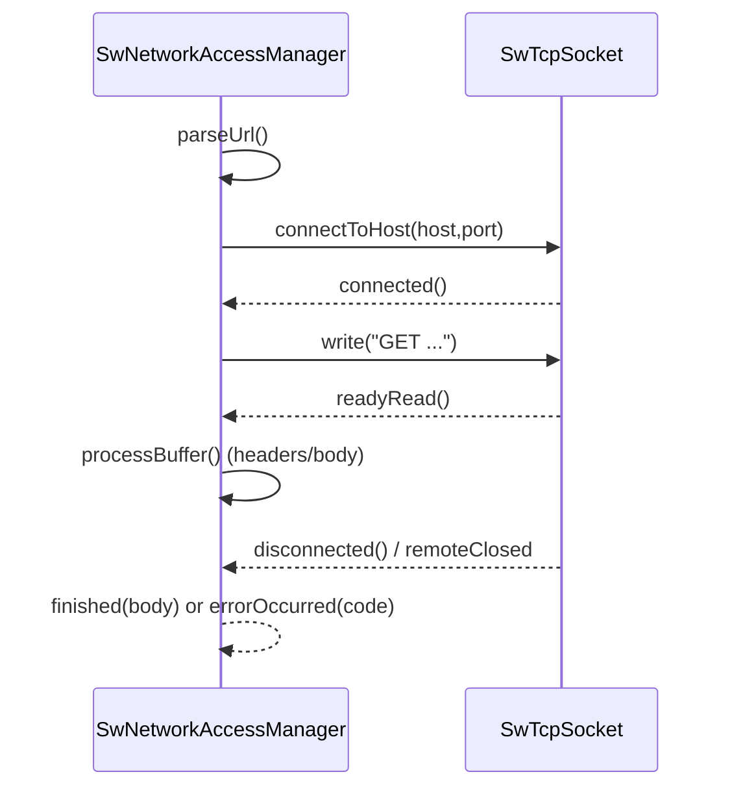

# IO réseau: TCP/UDP, TLS, HTTP (`SwNetworkAccessManager`)

## 1) But (Pourquoi)

Fournir une couche réseau “Qt-like” pour:

- gérer des sockets TCP/UDP non-bloquantes et pilotées par signaux,
- fournir un client HTTP/HTTPS minimal au-dessus de TCP,
- supporter TLS (Windows SChannel, et/ou backend OpenSSL chargé dynamiquement).

## 2) Périmètre

Inclut:
- API socket abstraite `SwAbstractSocket`,
- `SwTcpSocket`, `SwTcpServer`, `SwUdpSocket`,
- TLS:
  - Windows: SChannel (`SwTcpSocket.h`, branche `_WIN32`) `À CONFIRMER` détail,
  - backend OpenSSL dynamique: `SwBackendSsl` (utilisé comme backend pluggable),
- HTTP client: `SwNetworkAccessManager` (GET async, parsing headers/body minimal).

Exclut:
- IPC SHM (documenté ailleurs).

## 3) API & concepts

### `SwAbstractSocket` (base)

Définit l’interface et les signaux communs:

- `connectToHost(host, port)`
- `waitForConnected(ms)`, `waitForBytesWritten(ms)`
- `read(maxSize)`, `write(data)`, `close()`
- états `SocketState`
- signaux: `connected`, `disconnected`, `errorOccurred(int)`, `writeFinished`

Référence: `src/core/io/SwAbstractSocket.h`.

### `SwTcpSocket`

Principes:

- socket non-bloquante,
- notifications via signaux,
- support TLS via `useSsl(enabled, host)` avant `connectToHost` (`À CONFIRMER` API exacte).

Différences OS (observées):
- Windows:
  - Winsock2 + events,
  - TLS SChannel (branche `_WIN32`),
  - intégration GUI possible via `SwGuiApplication::waitForWorkGui` (`À CONFIRMER` chemins exacts).
- Linux:
  - `poll`/fds (`À CONFIRMER` impl exacte).

Référence: `src/core/io/SwTcpSocket.h`.

### `SwBackendSsl` (OpenSSL dynamique)

`SwBackendSsl` charge `libssl`/`libcrypto` à l’exécution et expose:

- `init(host, fd)` + `handshake()`,
- `read/write` avec un résultat type `IoResult` (Ok/WantRead/WantWrite/Closed/Error),
- `shutdown()` + `lastError()`.

Point sécurité:
- `À CONFIRMER`: vérification de certificat désactivée (commentaire “For now disable verification…”).

Référence: `src/core/io/SwBackendSsl.h`.

### `SwNetworkAccessManager` (HTTP/HTTPS client)

Client HTTP minimal:

- `setRawHeader(key, value)` (headers persistants),
- `get(url)` lance une requête async (GET),
- signaux:
  - `finished(const SwByteArray&)`
  - `errorOccurred(int)`
- parsing:
  - parse URL (scheme/host/port/path),
  - construit une requête HTTP/1.1,
  - parse headers (`\r\n\r\n`, `Content-Length`…) puis body.

Référence: `src/core/io/SwNetworkAccessManager.h`.

## 4) Flux d’exécution (Comment)

### HTTP GET (résumé)



## 5) Gestion d’erreurs

- Sockets:
  - erreurs remontées via `errorOccurred(int)` + logs stderr (`À CONFIRMER` codes).
- TLS:
  - `SwBackendSsl::lastError()` et `IoResult`.
  - attention aux erreurs si les libraries OpenSSL ne sont pas présentes (load dynamique).
- HTTP:
  - codes d’erreur internes négatifs dans `SwNetworkAccessManager` (`À CONFIRMER` liste).

## 6) Perf & mémoire

- `SwNetworkAccessManager` bufferise le body en mémoire (`SwByteArray`).
- Parsing HTTP est minimal (`À CONFIRMER`: pas de chunked encoding, pas de redirects).
- TLS:
  - copies possibles (buffers chiffrés/déchiffrés),
  - coût au premier usage (load dynamique).

## 7) Fichiers concernés (liste + rôle)

Sockets/TLS/HTTP:
- `src/core/io/SwAbstractSocket.h`
- `src/core/io/SwTcpSocket.h`
- `src/core/io/SwTcpServer.h`
- `src/core/io/SwUdpSocket.h`
- `src/core/io/SwNetworkAccessManager.h`
- `src/core/io/SwBackendSsl.h`

Types:
- `src/core/types/SwCrypto.h` (AES/base64 `À CONFIRMER` usages exacts)
- `src/core/types/SwByteArray.h`, `src/core/types/SwString.h`

Exemples:
- `exemples/03-TcpServer/TcpServer.cpp` (serveur TCP)
- `exemples/04-NetworkAccesManager/NetworkAccesManager.cpp` (HTTP client)
- `exemples/21-UdpProbe/UdpProbe.cpp` (UDP)
- `exemples/17-MjpegServer/MjpegServer.cpp` / `exemples/18-MjpegClient/MjpegClient.cpp` (streaming MJPEG `À CONFIRMER`)
- `exemples/22-TileServer/TileServer.cpp` (serveur HTTP-like `À CONFIRMER`)

## 8) Exemples d’usage

### GET HTTP

```cpp
SwCoreApplication app(argc, argv);
SwNetworkAccessManager nam;
SwObject::connect(&nam, SIGNAL(finished), [&](const SwByteArray& body){
  (void)body;
  app.quit();
});
nam.get("https://example.com/");
return app.exec();
```

## 9) TODO / À CONFIRMER

- `À CONFIRMER`: support HTTP “chunked transfer encoding” et redirections.
- `À CONFIRMER`: intégration monitoring socket (thread interne vs event loop) dans `SwTcpSocket`/`SwUdpSocket`.
- `À CONFIRMER`: politique TLS par défaut (SChannel vs OpenSSL) et vérification de certificat.
