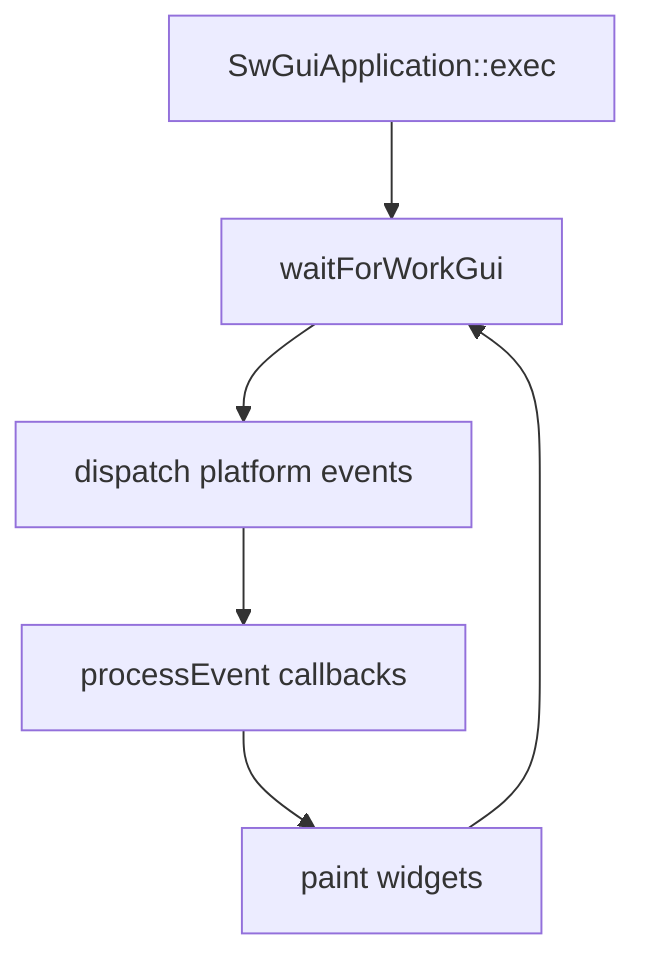

# GUI: `SwGuiApplication`, intégration platform, widgets

## 1) But (Pourquoi)

Fournir une UI légère (sans Qt) avec:

- une boucle GUI intégrée au runtime (`SwGuiApplication`),
- une couche d’abstraction platform (Win32/X11) pour fenêtres + rendu,
- un set de widgets (layout, style, controls, rendu vidéo).

## 2) Périmètre

Inclut:
- app GUI: `SwGuiApplication`,
- widgets “core”: `SwWidget`, `SwMainWindow`, layouts, style,
- rendu: `SwPainter`, fonts,
- intégration OS: `src/platform/**` (Win32/X11).

Exclut:
- media pipeline (doc dédiée),
- runtime internals (doc dédiée).

## 3) API & concepts

### `SwGuiApplication`

Rôle:
- hérite de `SwCoreApplication`,
- ajoute une pompe d’événements platform (Win32 messages / X11 events `À CONFIRMER`).

Référence: `src/core/gui/SwGuiApplication.h`.

### Intégration platform

Concepts:
- `SwPlatformIntegration` (factory d’objets platform: window, painter, image, … `À CONFIRMER` interfaces exactes),
- impl Win32: `src/platform/win/*.h`,
- impl X11: `src/platform/x11/*.h`.

Références:
- `src/platform/SwPlatformIntegration.h`
- `src/platform/SwPlatformFactory.h`

### Widgets

Base:
- `SwWidget` / `SwWidgetInterface` / `SwWidgetPlatformAdapter`

Fenêtre:
- `SwMainWindow`

Layout/style:
- `SwLayout`, `SwStyle`, `StyleSheet`

Controls:
- `SwLabel`, `SwPushButton`, `SwLineEdit`, `SwSlider`, `SwAbstractSlider`, etc.

Références: `src/core/gui/*.h` (liste non exhaustive).

## 4) Flux d’exécution (Comment)

`À CONFIRMER`: ordre exact “platform events vs core events vs paint” selon OS.

## 5) Gestion d’erreurs

- Platform init:
  - échec création fenêtre/painter → logs + exit (`À CONFIRMER` comportement).
- Widgets:
  - erreurs typiquement silencieuses (best-effort), logs debug `À CONFIRMER`.

## 6) Perf & mémoire

- Rendu:
  - attention aux invalidations fréquentes (repaint storms).
- Layout:
  - recalcul peut être coûteux si hiérarchie profonde.

## 7) Fichiers concernés (liste + rôle)

Core GUI:
- `src/core/gui/SwGuiApplication.h`
- `src/core/gui/SwWidget.h`
- `src/core/gui/SwMainWindow.h`
- `src/core/gui/SwLayout.h`
- `src/core/gui/SwStyle.h`
- `src/core/gui/StyleSheet.h`
- `src/core/gui/SwPainter.h`
- Controls: `src/core/gui/SwLabel.h`, `src/core/gui/SwPushButton.h`, `src/core/gui/SwLineEdit.h`, `src/core/gui/SwSlider.h`, `src/core/gui/SwAbstractSlider.h`
- Vidéo: `src/core/gui/SwVideoWidget.h`, `src/core/gui/SwMediaControlWidget.h`

Platform:
- `src/platform/SwPlatformIntegration.h`
- `src/platform/SwPlatformFactory.h`
- `src/platform/win/*.h`
- `src/platform/x11/*.h`

Exemples:
- `exemples/01-SimpleWindow/GuiApplication.cpp`
- `exemples/16-VideoWidget/VideoWidget.cpp`
- `exemples/18-SliderDemo/SliderDemo.cpp`
- `exemples/20-RtspVideoWidget/RtspVideoWidget.cpp`

## 8) Exemples d’usage

`À CONFIRMER`: API exacte des widgets selon les signatures des headers, voir:

- `exemples/01-SimpleWindow/GuiApplication.cpp`

## 9) TODO / À CONFIRMER

- `À CONFIRMER`: modèle de rendu (double-buffer, invalidation) et threading (rendu sur thread GUI uniquement ?).
- `À CONFIRMER`: couverture X11 vs Win32 (parité de features).
