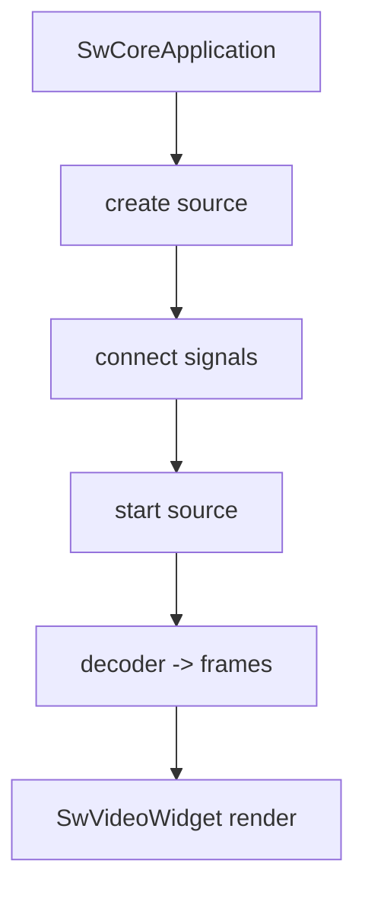
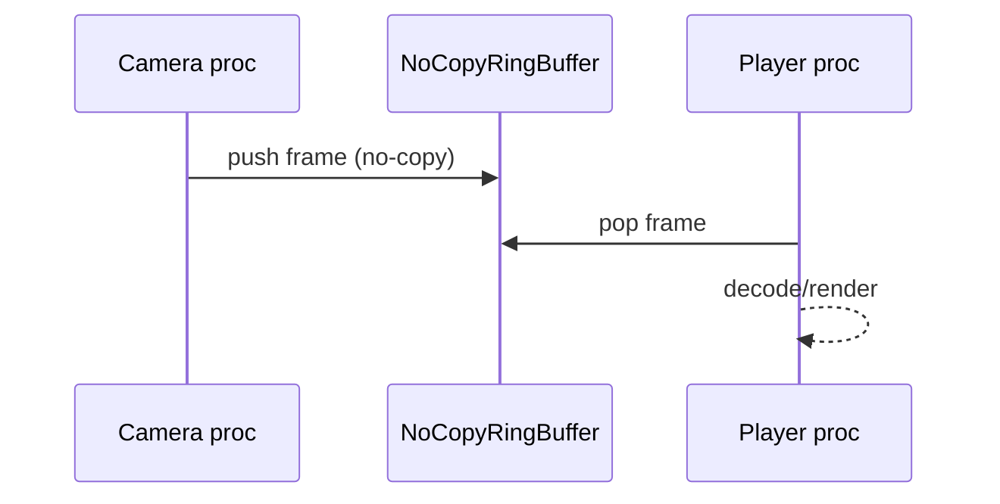

# Media: pipeline vidéo (sources/décodeurs/rendu) + ring buffer IPC vidéo

## 1) But (Pourquoi)

Fournir une chaîne vidéo simple:

- sources réseau (RTSP/UDP, MJPEG HTTP) et fichiers,
- décodage (Windows MediaFoundation `À CONFIRMER`: backends Linux),
- rendu via widget (GUI),
- option IPC: transport no-copy via ring buffer SHM pour séparer capture/affichage.

## 2) Périmètre

Inclut:
- interfaces `SwVideoSource` / `SwVideoDecoder`,
- impl sources: RTSP/UDP, MJPEG HTTP, fichier,
- types: packet/frame,
- widget vidéo,
- exemples ring buffer IPC vidéo.

Exclut:
- détails bas niveau du transport SHM (doc IPC).

## 3) API & concepts

### Types

- `SwVideoTypes` / `SwVideoPacket` / `SwVideoFrame` décrivent le format et le transport.

Références:
- `src/media/SwVideoTypes.h`
- `src/media/SwVideoPacket.h`
- `src/media/SwVideoFrame.h`

### Sources

- `SwVideoSource` est l’interface “push frames/packets” (`À CONFIRMER` signaux exacts).
- Implementations:
  - `SwRtspUdpSource` (RTSP/UDP)
  - `SwHttpMjpegSource` (HTTP MJPEG)
  - `SwFileVideoSource` (fichier)

Références:
- `src/media/SwVideoSource.h`
- `src/media/SwRtspUdpSource.h`
- `src/media/SwHttpMjpegSource.h`
- `src/media/SwFileVideoSource.h`

### Décodage

- `SwVideoDecoder` (interface),
- Windows: MediaFoundation (`SwMediaFoundation*.h`).

Références:
- `src/media/SwVideoDecoder.h`
- `src/media/SwMediaFoundation*.h`

### Rendu

- `SwVideoWidget` pour afficher une vidéo dans l’UI.

Référence: `src/core/gui/SwVideoWidget.h`.

### Ring buffer IPC no-copy (vidéo)

Pour dissocier producer/consumer (capture → player), le repo utilise un ring buffer SHM no-copy:

- `src/core/remote/SwIpcNoCopyRingBuffer.h`
- Exemples: `exemples/27-IpcVideoFrameRingBuffer/**`, `exemples/28-IpcRingBufferCameraPlayer/**`

## 4) Flux d’exécution (Comment)

### Player simplifié

### IPC ring buffer (résumé)

## 5) Gestion d’erreurs

- Réseau (RTSP/MJPEG):
  - connect/disconnect, timeouts `À CONFIRMER` selon impl.
- Décodage:
  - erreurs backend (MediaFoundation) propagées via logs/états `À CONFIRMER`.
- IPC:
  - mapping SHM échoue (permissions, taille) → fallback/erreur.

## 6) Perf & mémoire

- Ring buffer no-copy réduit les copies entre processus (mais nécessite synchronisation).
- MJPEG:
  - parsing HTTP minimal (risque sur gros flux) `À CONFIRMER`.
- RTSP/UDP:
  - buffering et pertes possibles (`À CONFIRMER` politique).

## 7) Fichiers concernés (liste + rôle)

Media:
- `src/media/SwVideoTypes.h`
- `src/media/SwVideoPacket.h`
- `src/media/SwVideoFrame.h`
- `src/media/SwVideoSource.h`
- `src/media/SwVideoDecoder.h`
- `src/media/SwRtspUdpSource.h`
- `src/media/SwHttpMjpegSource.h`
- `src/media/SwFileVideoSource.h`
- `src/media/SwMediaFoundation*.h`

GUI:
- `src/core/gui/SwVideoWidget.h`
- `src/core/gui/SwMediaControlWidget.h`

IPC:
- `src/core/remote/SwIpcNoCopyRingBuffer.h`

Exemples:
- `exemples/16-VideoWidget/**`
- `exemples/19-RtspUdpClient/**`
- `exemples/20-RtspVideoWidget/**`
- `exemples/17-MjpegServer/**`, `exemples/18-MjpegClient/**`
- `exemples/27-IpcVideoFrameRingBuffer/**`
- `exemples/28-IpcRingBufferCameraPlayer/**`

## 8) Exemples d’usage

`À CONFIRMER`: API exacte de `SwVideoSource` (signaux/callbacks) selon les impl; se référer aux exemples UI:

- `exemples/16-VideoWidget/VideoWidget.cpp`
- `exemples/20-RtspVideoWidget/RtspVideoWidget.cpp`

## 9) TODO / À CONFIRMER

- `À CONFIRMER`: backends disponibles côté Linux (décodage, capture).
- `À CONFIRMER`: garanties de timing du ring buffer (drop policy, latence).
