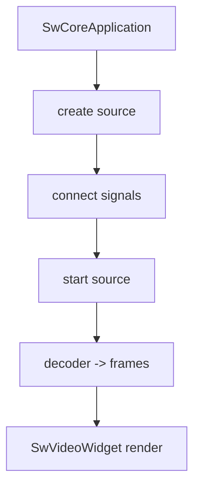
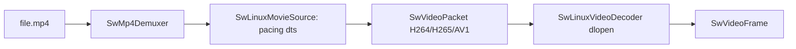
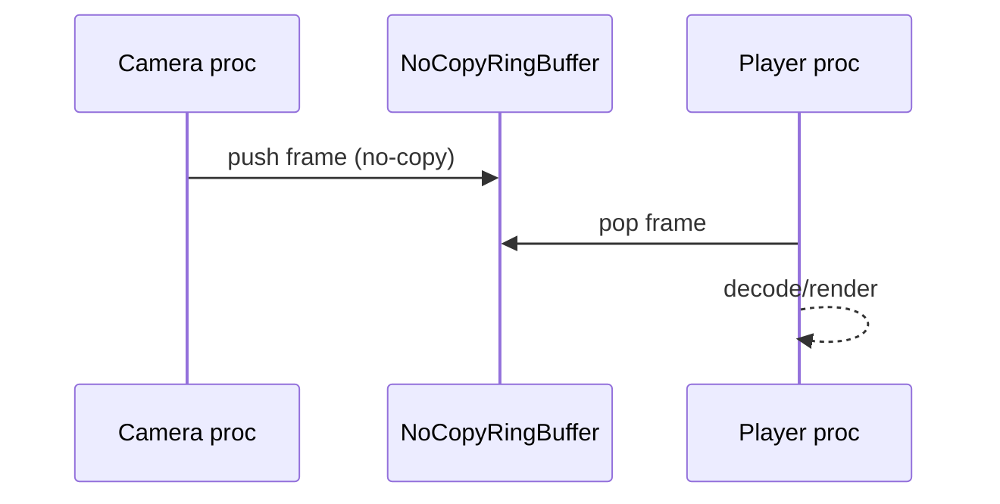

# Media: pipeline vidéo (sources/décodeurs/rendu) + ring buffer IPC vidéo

## 1) But (Pourquoi)

Fournir une chaîne vidéo simple:

- sources réseau (RTSP/UDP, MJPEG HTTP) et fichiers (MP4/MOV/M4V, flux Annex-B bruts),
- capture caméra (Windows MediaFoundation, Linux V4L2),
- décodage (Windows MediaFoundation; Linux OpenH264/libde265/VA-API chargés en dlopen),
- sortie audio (Windows WASAPI, Linux ALSA en dlopen),
- rendu via widget (GUI),
- option IPC: transport no-copy via ring buffer SHM pour séparer capture/affichage.

## 2) Périmètre

Inclut:
- interfaces `SwVideoSource` / `SwVideoDecoder`,
- impl sources: RTSP/UDP, MJPEG HTTP, fichier (Annex-B brut + conteneurs MP4),
- capture caméra plateforme (`SwPlatformVideoSource`),
- démuxeur MP4 natif (`SwMp4Demuxer`, sans dépendance),
- sortie audio plateforme (`SwAudioOutput` → WASAPI/ALSA),
- décodeurs audio (G.711 builtin, Opus via MediaFoundation ou libopus),
- types: packet/frame,
- widget vidéo,
- exemples ring buffer IPC vidéo.

Exclut:
- détails bas niveau du transport SHM (doc IPC),
- SwVTP (doc `85_swvtp_av1_low_latency.md`).

## 3) API & concepts

### Types

- `SwVideoTypes` / `SwVideoPacket` / `SwVideoFrame` décrivent le format et le transport.

Références:
- `src/media/SwVideoTypes.h`
- `src/media/SwVideoPacket.h`
- `src/media/SwVideoFrame.h`

### Sources

- `SwVideoSource` est l'interface "push packets" (callback `setPacketCallback`, statut via
  `SwMediaSource::emitStatus`, pistes via `setTracks`).
- Implémentations:
  - `SwRtspUdpSource` (RTSP sur UDP **et** TCP interleaved, alias `SwRtspSource`)
  - `SwHttpMjpegSource` (HTTP MJPEG)
  - `SwFileVideoSource` (fichier Annex-B brut, sans timing)
  - `SwPlatformMovieSource` (conteneurs, seekable):
    - Windows → `SwMediaFoundationMovieSource` (MP4/MKV/AVI/..., décodé en RawBGRA)
    - toutes les autres plateformes → `SwMp4MovieSource` (plateforme-neutre; MP4/MOV/M4V via
      `SwMp4Demuxer`, émet les échantillons compressés H264/H265/AV1 en Annex-B/OBU, pacés
      en temps réel sur les dts; le décodage passe par les décodeurs du pipeline; reprise
      pause/play et seek-avant-start supportés; `SwLinuxMovieSource` reste un alias)
  - `SwPlatformVideoSource` (capture caméra):
    - Windows → `SwMediaFoundationVideoSource` (RawBGRA)
    - Linux → `SwLinuxVideoSource` (V4L2 pur ioctl/mmap: YUYV/RGB24/BGR24 convertis en
      RawBGRA, MJPEG transmis en `Codec::MotionJPEG`)
  - `SwSrtVideoSource` (SRT, interop OBS/ffmpeg/encodeurs matériels): reçoit du MPEG-TS
    sur SRT et le démuxe via `SwTsProgramDemux`. `libsrt` est chargée en dlopen
    (`SwSrtLibrary`, zéro dépendance à l'édition de liens; repli gracieux si absente).
    Modes caller (`srt://host:port`) et listener (`srt://:port` ou `?mode=listener`),
    options `?streamid=`, `?passphrase=`, `?latency=<ms>` (SRTO_RCVLATENCY), reconnexion
    automatique avec statut `Recovering`.
- `SwMediaSourceFactory` route par schéma d'URL (`rtsp`, `http`, `rtp`, `udp`, `swvtp`,
  `srt`, `file`); `file://*.mp4|*.mov|*.m4v` va vers `SwPlatformMovieSource` sur toutes
  les plateformes. Hors Windows, l'en-tête du fichier est sniffé
  (`SwMp4Demuxer::looksLikeBmff`): un flux Annex-B brut nommé `.mp4` continue de passer
  par `SwFileVideoSource`.

Références:
- `src/media/SwVideoSource.h`
- `src/media/SwRtspUdpSource.h`
- `src/media/SwHttpMjpegSource.h`
- `src/media/SwFileVideoSource.h`
- `src/media/SwMp4MovieSource.h`
- `src/media/SwLinuxVideoSource.h`
- `src/media/SwMp4Demuxer.h`
- `src/media/SwMediaSourceFactory.h`

### Démuxeur MP4 natif

`SwMp4Demuxer` (plateforme-neutre, zéro dépendance) parse les tables d'échantillons `moov`
des MP4 progressifs: pts/dts en ms, key frames (`stss`), offsets (`stsc`/`stco`/`co64`),
conversion NAL length-prefixed → Annex-B, jeux de paramètres `avcC`/`hvcC` exposés en préfixe
de key frame, config OBUs `av1C` pour l'AV1, `findSyncSampleAtOrBefore` pour le seek.
Limites: MP4 fragmenté (`moof`) rejeté explicitement, edit lists (`elst`) ignorées.

### Décodage

- `SwVideoDecoder` (interface) + registre par codec,
- Windows: MediaFoundation (`SwMediaFoundation*.h`) — H264/H265/AV1, HW+SW,
- Linux: `SwLinuxVideoDecoder` — OpenH264 (H264), libde265 (H265), VA-API, chargés en
  dlopen (aucun lien à l'édition de liens),
- Android: `SwAndroidMediaCodecVideoDecoder`.

Contrat de temps: les frames décodées portent un timestamp en unités **100 ns** sur toutes
les plateformes (`swLinuxPacketPtsToHns` convertit depuis `packet.clockRate()`, défaut RTP
90 kHz — même logique que le décodeur MediaFoundation). `SwVideoWidget` s'appuie dessus
pour sa fenêtre de présentation.

Références:
- `src/media/SwVideoDecoder.h`
- `src/media/SwMediaFoundation*.h`
- `src/media/SwLinuxVideoDecoder.h`

### Audio

- `SwAudioOutput` choisit le sink plateforme: WASAPI (Windows, ~20 ms de tampon), ALSA
  (Linux, dlopen `libasound`, ~50 ms de tampon). Le device par défaut est sondé une fois
  (`SwAlsaAudioSink::defaultDeviceUsable`): lib absente **ou** pas de carte son (conteneur,
  headless) → repli `SwNullAudioSink` sans retentative par paquet. Le handle PCM n'est
  touché que par le thread worker (flush relayé par flag).
- Décodeurs audio (`SwAudioDecoderFactory`): G.711 PCMU/PCMA builtin; Opus via
  MediaFoundation (Windows) ou libopus (Linux, dlopen). AAC déclaré mais sans décodeur.

Références:
- `src/media/SwAudioOutput.h`
- `src/media/SwWasapiAudioSink.h`
- `src/media/SwAlsaAudioSink.h`
- `src/media/SwOpusAudioDecoder.h`

### Rendu

- `SwVideoWidget` pour afficher une vidéo dans l'UI.

Référence: `src/core/gui/SwVideoWidget.h`.

### Ring buffer IPC no-copy (vidéo)

Pour dissocier producer/consumer (capture → player), le repo utilise un ring buffer SHM no-copy:

- `src/core/remote/SwIpcNoCopyRingBuffer.h`
- Exemples: `exemples/27-IpcVideoFrameRingBuffer/**`, `exemples/28-IpcRingBufferCameraPlayer/**`

## 4) Flux d'exécution (Comment)

### Player simplifié

```mermaid
flowchart TD
  A[SwCoreApplication] --> B[create source]
  B --> C[connect signals]
  C --> D[start source]
  D --> E[decoder -> frames]
  E --> F[SwVideoWidget render]
```

### Lecture fichier Linux

```mermaid
flowchart LR
  A[file.mp4] --> B[SwMp4Demuxer]
  B --> C[SwLinuxMovieSource: pacing dts]
  C --> D[SwVideoPacket H264/H265/AV1]
  D --> E[SwLinuxVideoDecoder dlopen]
  E --> F[SwVideoFrame]
```

### IPC ring buffer (résumé)

```mermaid
sequenceDiagram
  participant Cam as Camera proc
  participant SHM as NoCopyRingBuffer
  participant Player as Player proc

  Cam->>SHM: push frame (no-copy)
  Player->>SHM: pop frame
  Player-->>Player: decode/render
```

## 5) Gestion d'erreurs

- Réseau (RTSP/MJPEG): connect/disconnect, fallback UDP→TCP, statut `Recovering`.
- Fichier: MP4 fragmenté ou piste non supportée → `initialize()` false + statut `Recovering`;
  `errorText()` du démuxeur donne la cause.
- Capture V4L2: device absent/format non convertible → `initialize()` false, log errno.
- Décodage: erreurs backend propagées via logs/états.
- Audio: `libasound`/device absents → repli `SwNullAudioSink` (pas d'erreur fatale).
- IPC: mapping SHM échoue (permissions, taille) → fallback/erreur.

## 6) Perf & mémoire

- Ring buffer no-copy réduit les copies entre processus (mais nécessite synchronisation).
- Lecture MP4: les tables `moov` sont chargées en mémoire (borne 64 Mo), les échantillons
  sont lus à la demande (pas de chargement complet du fichier).
- Capture V4L2: buffers mmap kernel (4), conversion BGRA une passe.
- MJPEG: parsing HTTP minimal (risque sur gros flux).

## 7) Fichiers concernés (liste + rôle)

Media:
- `src/media/SwVideoTypes.h` / `SwVideoPacket.h` / `SwVideoFrame.h` — types
- `src/media/SwVideoSource.h` / `SwVideoDecoder.h` — interfaces
- `src/media/SwRtspUdpSource.h` — client RTSP (UDP + TCP interleaved)
- `src/media/SwHttpMjpegSource.h` — client MJPEG HTTP
- `src/media/SwFileVideoSource.h` — fichier Annex-B brut
- `src/media/SwMp4Demuxer.h` — démuxeur MP4 natif (toutes plateformes)
- `src/media/SwLinuxMovieSource.h` — lecture MP4 Linux (pacing + seek)
- `src/media/SwLinuxVideoSource.h` — capture V4L2
- `src/media/SwLinuxVideoDecoder.h` — décodeurs Linux (dlopen)
- `src/media/SwMediaFoundation*.h` — backends Windows
- `src/media/SwAudioOutput.h` / `SwWasapiAudioSink.h` / `SwAlsaAudioSink.h` — sortie audio
- `src/media/SwAudioDecoder.h` / `SwOpusAudioDecoder.h` — décodeurs audio
- `src/media/SwMediaSourceFactory.h` — routage par URL

GUI:
- `src/core/gui/SwVideoWidget.h`
- `src/core/gui/SwMediaControlWidget.h`

IPC:
- `src/core/remote/SwIpcNoCopyRingBuffer.h`

Exemples:
- `exemples/16-VideoWidget/**`
- `exemples/19-RtspUdpClient/**`
- `exemples/20-RtspVideoWidget/**`
- `exemples/17-MjpegServer/**`, `exemples/18-MjpegClient/**`
- `exemples/27-IpcVideoFrameRingBuffer/**`
- `exemples/28-IpcRingBufferCameraPlayer/**`
- `exemples/61-PlatformVideoDecoderSelfTest/**`
- `exemples/95-LinuxMediaBackendsSelfTest/**` — self-test des backends Linux + démuxeur MP4
  (CTest, ON par défaut, passe sous Windows et WSL)

## 8) Exemples d'usage

- `exemples/16-VideoWidget/VideoWidget.cpp`, `exemples/20-RtspVideoWidget/RtspVideoWidget.cpp`
  (UI),
- `exemples/95-LinuxMediaBackendsSelfTest/LinuxMediaBackendsSelfTest.cpp` (démux MP4,
  lecture fichier avec seek, V4L2/ALSA/Opus).

## 9) TODO / limites connues

- MP4: fichiers fragmentés (`moof`) non supportés; edit lists ignorées (léger décalage pts
  possible sur certains encodages); MKV/AVI non couverts hors Windows.
- VA-API H264: chemin de décodage matériel non implémenté (OpenH264 assure le logiciel).
- AAC: déclaré dans l'enum audio, aucun décodeur enregistré.
- VP8/VP9: déclarés dans l'enum vidéo, aucun backend.
- SRT: réception **et** émission supportées. Réception: `SwSrtVideoSource` (MPEG-TS sur
  SRT → `SwTsProgramDemux`). Émission: `SwSrtServerTransport` (listener SRT multi-clients,
  `SwMediaServerFactory` route `srt://`, port défaut 9710) muxant via `SwTsMuxer`
  (`media/rtp/SwTsMuxer.h`, PAT/PMT avec CRC32 MPEG valide, PCR, PES multi-paquets —
  sortie conforme consommable par ffplay/VLC). Chaîne complète serveur→source validée E2E
  en boucle locale par `exemples/96-SrtMediaSelfTest` (roundtrip muxeur→démuxeur byte-exact
  inclus). Non couvert: audio dans le TS émis (vidéo seule), stats SRT → feedback ABR.
- Capture V4L2: pas de sélection résolution/framerate exposée (format du driver conservé);
  MJPEG transmis sans décodage; conversion YUYV→BGRA scalaire (pas de SIMD) et allocation
  du payload par frame (`SwByteArray` ne sait pas allouer sans zero-fill) — piste: émettre
  du YUY2 brut (le widget sait le convertir) ou ajouter un resize non-initialisé à
  SwByteArray.
- Dette advisory: 4 copies du noyau BT.601 YUV→BGRA dans le repo (widget, MF ×2, V4L2);
  3 loaders dlopen artisanaux alors que `SwLibrary` (core/runtime) offre les diagnostics.
  (Résolu: le parcours NAL length-prefixed est partagé via
  `swForEachLengthPrefixedNalUnit` dans `SwHevcBitstream.h`; le seek MP4 utilise un index
  de sync samples précalculé en O(log n); la factory ne parse plus le SDP qu'une fois.)
- Android: pas de capture caméra ni de sortie audio.
