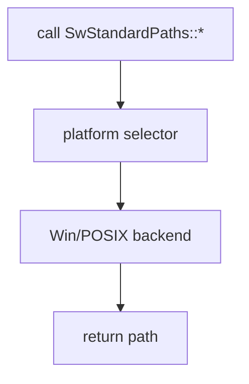

# OS/FS: fichiers, dossiers, paths, settings, plateforme Win/POSIX

## 1) But (Pourquoi)

Fournir des wrappers OS “Qt-like” pour:

- lire/écrire des fichiers et flux (IODevice/File),
- manipuler dossiers et infos fichier,
- obtenir des paths standards (home/temp/appdata),
- stocker des settings persistants,
- abstraire les différences Win/POSIX via une couche platform.

## 2) Périmètre

Inclut:
- IO fichiers/process/stream: `SwFile`, `SwIODevice`, `SwIODescriptor`, `SwProcess`,
- filesystem: `SwDir`, `SwFileInfo`,
- paths: `SwStandardPaths`, `SwStandardLocation*`,
- settings: `SwSettings`,
- backend platform FS: `SwPlatform*`.

Exclut:
- réseau (doc IO réseau),
- config remote (doc config/nodes).

## 3) API & concepts

### IO files/streams

Références:
- `src/core/io/SwFile.h`
- `src/core/io/SwIODevice.h`
- `src/core/io/SwIODescriptor.h`

`À CONFIRMER`: modes d’ouverture, erreurs, et comportement exact (buffering, non-blocking).

### Process

- Wrapper process (spawn, wait, pipes `À CONFIRMER`).

Référence: `src/core/io/SwProcess.h`.

### Dir/FileInfo

- `SwDir` (listings, création/suppression `À CONFIRMER`),
- `SwFileInfo` (metadata, stat, path helpers `À CONFIRMER`).

Références:
- `src/core/fs/SwDir.h`
- `src/core/fs/SwFileInfo.h`

### Standard paths

- API pour localiser des dossiers standards (temp, home, config, etc).

Références:
- `src/core/fs/SwStandardPaths.h`
- `src/core/fs/SwStandardLocation.h`
- `src/core/fs/SwStandardLocationDefs.h`

### Settings

- Stockage clé/valeur persistant (backend `À CONFIRMER`).

Référence: `src/core/fs/SwSettings.h`.

### Platform backends (Win/POSIX)

- Sélection compile-time d’un backend FS.

Références:
- `src/core/platform/SwPlatform.h`
- `src/core/platform/SwPlatformPosix.h`
- `src/core/platform/SwPlatformWin.h`
- `src/core/platform/SwPlatformSelector.h`

## 4) Flux d’exécution (Comment)

### Résolution d’un “standard path” (simplifiée)

## 5) Gestion d’erreurs

- IO:
  - open/read/write peuvent échouer (permissions, path invalide) → `À CONFIRMER` codes/retours.
- Settings:
  - best-effort si backend non dispo (`À CONFIRMER`).

## 6) Perf & mémoire

- IO:
  - attention aux lectures complètes en mémoire (`readAll`) vs streaming.
- Settings:
  - écritures fréquentes → préférer batching/debounce si nécessaire.

## 7) Fichiers concernés (liste + rôle)

- `src/core/io/SwFile.h`
- `src/core/io/SwIODevice.h`
- `src/core/io/SwIODescriptor.h`
- `src/core/io/SwProcess.h`
- `src/core/fs/SwDir.h`
- `src/core/fs/SwFileInfo.h`
- `src/core/fs/SwStandardPaths.h`
- `src/core/fs/SwStandardLocation.h`
- `src/core/fs/SwStandardLocationDefs.h`
- `src/core/fs/SwSettings.h`
- `src/core/platform/SwPlatform.h`
- `src/core/platform/SwPlatformPosix.h`
- `src/core/platform/SwPlatformWin.h`
- `src/core/platform/SwPlatformSelector.h`

Exemples:
- `exemples/10-SwProcessExample/SwProcessExample.cpp`

## 8) Exemples d’usage

`À CONFIRMER`: API exacte selon headers, voir l’exemple process:

- `exemples/10-SwProcessExample/SwProcessExample.cpp`

## 9) TODO / À CONFIRMER

- `À CONFIRMER`: backend exact de `SwSettings` et format sur disque.
- `À CONFIRMER`: compat Win/POSIX (paths, encodage, séparateurs, symlinks).
