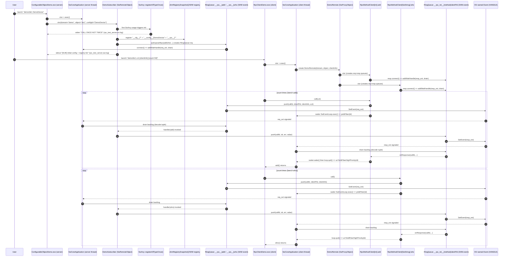

# RPC benchmark (example 23) — sequence diagram

```mermaid
sequenceDiagram
    autonumber
    participant U as User
    participant S as ConfigurableObjectDemo.exe (server)
    participant SA as SwCoreApplication (server thread)
    participant Sub as DemoSubscriber (SwRemoteObject)
    participant Any as SwAny::registerAllTypeOnce()
    participant Reg as shmRegistrySnapshot()/SHM registry
    participant Req as RingQueue __rpc__|add / __rpc__|who (SHM event)
    participant C as RpcClientDemo.exe (client)
    participant CA as SwCoreApplication (client thread)
    participant Remote as DemoRemote (SwProxyObject)
    participant AddC as RpcMethodClient[int] add
    participant WhoC as RpcMethodClient[SwString] who
    participant Resp as RingQueue __rpc_ret__|method|clientPid (SHM event)
    participant EV as OS named Event (HANDLE)

    U->>S: launch "demo/de1 DemoDevice"
    S->>SA: ctor + exec()
    S->>Sub: ctor(domain="demo", object="de1", configId="DemoDevice")
    Sub->>Any: first SwAny usage triggers init
    Any-->>S: stderr "CALL ONCE NOT TWICE" (rpc_test_server.err.log)
    Sub->>Reg: register "__cfg__|*" + "__config__|DemoDevice" + "__rpc__|*"
    Sub->>Req: ipcExposeRpc(add/who/...) creates RingQueue req
    Req->>SA: connect() => addWaitHandle(req_evt, drain)
    Sub-->>S: stdout "[SUB] initial config + registry list" (rpc_test_server.out.log)

    U->>C: launch "demo/de1 a b [clientInfo] [count=50]"
    C->>CA: ctor + exec()
    CA->>Remote: create DemoRemote(domain, object, clientInfo)
    Remote->>AddC: ctor (creates req+resp queues)
    AddC->>Resp: resp.connect() => addWaitHandle(resp_evt, drain)
    Remote->>WhoC: ctor (creates req+resp queues)
    WhoC->>Resp: resp.connect() => addWaitHandle(resp_evt, drain)

    loop count times (bench add)
        C->>AddC: call(a,b)
        AddC->>Req: push(callId, clientPid, clientInfo, a,b)
        Req->>EV: SetEvent(req_evt)
        AddC->>CA: waiter SwEventLoop.exec() => yieldFiber(id)

        EV-->>SA: req_evt signaled
        SA->>Req: drain backlog (decode tuple)
        Req-->>Sub: handler(add) invoked
        Sub->>Resp: push(callId, ok, err, value)
        Resp->>EV: SetEvent(resp_evt)

        EV-->>CA: resp_evt signaled
        CA->>Resp: drain backlog (decode tuple)
        Resp-->>AddC: onResponse(callId,...)
        AddC-->>CA: waiter.wake() then loop.quit() => unYieldFiberHighPriority(id)
        CA-->>C: add() returns
    end

    loop count times (bench who)
        C->>WhoC: call()
        WhoC->>Req: push(callId, clientPid, clientInfo)
        Req->>EV: SetEvent(req_evt)
        WhoC->>CA: waiter SwEventLoop.exec() => yieldFiber(id)
        EV-->>SA: req_evt signaled
        SA->>Req: drain backlog
        Req-->>Sub: handler(who) invoked
        Sub->>Resp: push(callId, ok, err, value)
        Resp->>EV: SetEvent(resp_evt)
        EV-->>CA: resp_evt signaled
        CA->>Resp: drain backlog
        Resp-->>WhoC: onResponse(callId,...)
        WhoC-->>CA: loop.quit() => unYieldFiberHighPriority(id)
        CA-->>C: who() returns
    end
```
